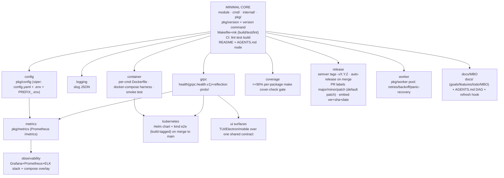

# Go Project Scaffold — the go team's standard baseline

Reference for the **go team** when starting or scaffolding a new Go service or
project. **Doctrine: propose the minimal core, then _ask and suggest_ the optional
layers — never impose the full stack.** Recommend what fits the described use case
and let the user opt in. Wire chosen layers per this doc so they compose cleanly.

## Scaffold DAG

## Minimal core (always propose)

- **Single Go module**, one binary per `cmd/<name>/main.go`.
- **`internal/`** for private code (config, logging, clients); **`pkg/`** for public
  libraries — including **`pkg/version`** (ldflags-injectable `Version`/`Commit`/`BuildDate`)
  and a **`version` / `--version` command in every binary**.
- **`Makefile` + `mk/*.mk`** split by concern (build, test, lint), plus a `help` target.
- **CI**: lint + test (race) + build, path-filtered. Lint: install `golangci-lint` v2
  with the CI Go toolchain (a prebuilt binary built with an older Go refuses a newer
  target Go).
- **`README.md` + `AGENTS.md`** (with a `CLAUDE.md -> AGENTS.md` symlink) as the
  discovery node.

## Suggested layers (ask which to add; deps in parens)

| Layer | Adds | Depends on |
|-------|------|-----------|
| **config** | `pkg/config` (viper): `config.yaml` + `.env` + `PREFIX_` env; precedence env>.env>yaml>defaults | core |
| **logging** | structured slog JSON | core |
| **grpc** | `grpc.health.v1` health + reflection; `proto/` contracts | a service |
| **metrics** | `pkg/metrics` (Prometheus) `/metrics` + HTTP/gRPC interceptors | config |
| **container** | per-`cmd` multi-stage Dockerfile + `docker-compose` harness + smoke test | core |
| **coverage** | `make cover-check` gate, ≥90% per gated package (honest `go test -cover`) | CI |
| **release** | semver tags `<proj>-vX.Y.Z`; auto-release on merge to main from PR labels (`release:major/minor/patch`, default patch); embed version+sha+date | CI |
| **worker** | `pkg/worker` pool: N workers, wake-on-submit, exponential-backoff retries, panic recovery, graceful drain | core |
| **observability** | Grafana + Prometheus + ELK (Fluent Bit→Logstash→Elasticsearch) stack + compose overlay wiring | metrics |
| **kubernetes** | Helm chart (Deployments/Services/probes/scrape annotations) + kind e2e (`//go:build e2e`) on merge to main | container, grpc |
| **docs/MBO** | `docs/` (goals, features, todo, MBO plans) + cascading `AGENTS.md` DAG + a hook reminding to refresh the nearest `AGENTS.md` | core |
| **ui surfaces** | TUI (Bubble Tea) / Electron / mobile over one shared UX contract | a service |

## How to present it

1. Recommend the **minimal core**.
2. From the described use case, name the **layers that fit** and why (e.g. "a gRPC
   service → add grpc + metrics + container; deploying to k8s → add kubernetes").
3. Let the user pick. Add only opted-in layers; keep each one wired per this doc.
