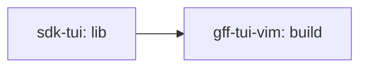

# gff TUI — vim navigation, `/` regex search, `:` command line — implementation plan

> **For agentic workers:** REQUIRED SUB-SKILL: Use superpowers:subagent-driven-development (recommended) or superpowers:executing-plans to implement this plan task-by-task. Steps use checkbox (`- [ ]`) syntax for tracking. The execution trio lives in [`./gff-tui-vim/`](./gff-tui-vim/).

- **Slug:** `gff-tui-vim`
- **Date:** 2026-09-05 (revised the same day to consume `sdk/libs/tui`)
- **Status:** Approved — **blocked on `sdk-tui`** (plan [`./sdk-tui.md`](./sdk-tui.md); this build worker stacks on its `lib` branch)
- **Relates to:** spec [`../specs/gff-tui-vim.md`](../specs/gff-tui-vim.md) · lib plan [`./sdk-tui.md`](./sdk-tui.md) §3 (frozen contracts) · guide `sdk/libs/tui/GUIDE.md` · parent `gff` plan [`./gff.md`](./gff.md) P3-T1 · feature `gss feature gff-tui-vim` · issue #281 · design PR #280

**Goal:** Make `gff tui` navigable with vim keys, searchable with `/` (incremental regex, `n`/`N`), and scriptable with a `:` command line (`:set`, `:unset`, `:q`, `:help`, `:/re`, Tab completion) — as the **first consumer** of `sdk/libs/tui`.

**Architecture:** gff's bubbletea `Model` composes `keymap`, `nav`, `search`, `cmdline`, and `overlay` from `sdk/libs/tui` and keeps only what is gff's: the collapsible area tree (auto-expand on match, `inScope`, `rowKey` anchors), row rendering, `:set`/`:unset` validation against flag types, and the override writers. No new dependency beyond `libs`.

**Tech Stack:** Go 1.26, bubbletea v1.3.10, lipgloss v1.1.0, testify, `sdk/libs/tui` via the standard `replace ../libs`.

**Spec:** [`../specs/gff-tui-vim.md`](../specs/gff-tui-vim.md)

## Global constraints

- Coverage: `sdk/gff` module ≥ 90% (gate in `.github/workflows/gff-ci.yml`); `internal/tui` ≥ 91.3% (its current value); `internal/resolve` ≥ 95%.
- Frozen contracts in [`./gff.md`](./gff.md) §3 untouched. Writes only to the user override file; tests only under `t.TempDir()`.
- `sdk/gff/go.mod` gains `require github.com/sfc-gh-eraigosa/dotfiles/sdk/libs v0.0.0` + `replace … => ../libs`, nothing else.
- The lib API is [`./sdk-tui.md`](./sdk-tui.md) §3 — **consume, never fork**. A missing capability is a TRACKING blocker escalated to `sdk-tui`, not a local copy.
- Real key shapes in tests. `h`/`H` never open help after Task 1; `?`/F1 do.
- Stage by explicit name; one commit per task; plan messages verbatim + session trailers; evidence `tee`'d to `docs/mbo/plans/gff-tui-vim/evidence/<task>/`.

---

## 1. Summary & verdict

Same behavior as the original plan (design approved in chat 2026-09-05), re-cut after the owner's review to ride `sdk/libs/tui` instead of re-implementing it. Seven tasks became four: the editor, motion engine, search state machine, command parser, and help renderer now come from the lib with their own tests; gff keeps the glue. Risk: low; the one moving part is the lib API, frozen at `sdk-tui` Task 2.

## 2. File inventory

| Path | Purpose | Implements |
| :-- | :-- | :-- |
| `sdk/gff/go.mod`, `go.sum` | `libs` require + replace | — |
| `sdk/gff/internal/tui/keys.go` | `gffKeys` (= `keymap.Vim.Merge(select/confirm/unset)`), `palette` adapter over `internal/style`, `listHint` | F1, F2, F8, F9 |
| `sdk/gff/internal/tui/model.go` | `cur nav.Cursor` replaces `cursor/scrollTop/lastInner`; modes `modeSearch`/`modeCommand`; dispatch; `?`/F1 | F1–F6 |
| `sdk/gff/internal/tui/search.go` | gff glue over `search.State`: `rowKey`, `inScope`, `hit`, `startSearch/applySearch/commitSearch/cancelSearch/jump/noh` (auto-expand) | F3–F5 |
| `sdk/gff/internal/tui/command.go` | `parseValue`, `findKey`, `completeKey`, the `set`/`unset` specs, `registerCommands`, `updateCommand` | F6, F7 |
| `sdk/gff/internal/tui/view.go` | viewport via `cur.Visible()`; prompt/error footer; badge; `*` gutter; help via `overlay.Help` + SOURCES section | F2, F5, F8, F9 |
| `sdk/gff/internal/tui/vim_test.go` | motions, help rebind, picker `j/k`, footer-from-keymap (package `tui_test`) | F1, F2, F9 |
| `sdk/gff/internal/tui/search_test.go` | `/` flow, auto-expand, `n/N`, Esc, errors, gutter, frame height | F3–F5, F8 |
| `sdk/gff/internal/tui/command_test.go` | `:set`/`:unset`/`:q`/`:help`/`:/re`, Tab, file assertions | F6, F7 |
| `sdk/gff/internal/tui/command_internal_test.go` | `parseValue`, `findKey` tables (package `tui`) | F6 validation |
| `sdk/gff/internal/tui/round2_test.go` | `TestHelpOverlayFromDetail` `'h'` → `'?'` | F2b |
| `sdk/gff/internal/resolve/resolve.go`, `resolve_test.go` | `Resolved.WithNamespace` test helper | — |
| `sdk/gff/cmd/tui.go`, `cmd/tui_keys_test.go` | `Long` from the same key table; pin test | F9 |
| `sdk/gff/README.md`, `sdk/gff/AGENTS.md` | key table; pointer to `libs/tui/GUIDE.md` | F9 |
| `docs/mbo/plans/gff-tui-vim/evidence/**` | gates + demo | spec §6 |

## 3. Interface contracts

Consumed (frozen in [`./sdk-tui.md`](./sdk-tui.md) §3): `keymap.{Vim,Map,Binding,Dispatch,Handlers,KeyName}`, `nav.Cursor`, `search.State`/`Compile`, `cmdline.{State,Registry,Spec,Standard}`, `overlay.{Help,Section,Palette,Plain}`.

gff-side names (final):

```go
// keys.go
const actUnset keymap.Action = "unset"              // u
var gffKeys = keymap.Vim.Merge(
    keymap.Binding{Action: keymap.Select,  Keys: []string{"space"}, Help: "toggle a bool / pick choice options (same writer as `gff set`)", Short: "toggle", Header: true},
    keymap.Binding{Action: keymap.Confirm, Keys: []string{"enter"}, Help: "expand an area / open feature details (attributes + layers)", Short: "open", Header: true},
    keymap.Binding{Action: actUnset,       Keys: []string{"u"},     Help: "clear the user override for the row (same as `gff unset`)", Short: "clear", Header: true},
)
type palette struct{ pal style.Colors }              // overlay.Palette over lipgloss; NO_COLOR → overlay.Plain
func newPalette() overlay.Palette
func listHint() string                              // gffKeys.HeaderHint("  ")

// model.go additions
const ( modeSearch screenMode = iota + 4; modeCommand )
type Model struct { …; cur nav.Cursor; search search.State; searchAnchor string; cmd cmdline.State; reg cmdline.Registry; … }
// `cursor` → `cur.Pos`, `scrollTop` → `cur.Top`, `lastInner` → `cur.Height` everywhere.
func (m *Model) turnPage(dir int)

// search.go (gff glue)
func rowKey(r row) string
func (m *Model) inScope(item resolve.Resolved) bool
func (m *Model) rowIndexOf(key string) int
func (m *Model) hit(i int) bool                     // rows[i] is a feature row matching search.Re
func (m *Model) collect()                           // search.Collect over the rows (buildRows calls it)
func (m *Model) startSearch()
func (m *Model) applySearch()                       // reveal (expand) + buildRows + First
func (m *Model) commitSearch()
func (m *Model) cancelSearch()
func (m *Model) jump(dir int)                       // n/N incl. re-arm
func (m *Model) noh()
func (m *Model) updateSearch(msg tea.KeyMsg) (tea.Model, tea.Cmd)

// command.go (gff glue)
func parseValue(item resolve.Resolved, raw string) (*gffv1.Value, error)
func (m *Model) findKey(key string) (int, error)
func (m *Model) completeKey(prefix string) []string
func (m *Model) registerCommands()                  // Standard + set + unset
func (m *Model) updateCommand(msg tea.KeyMsg) (tea.Model, tea.Cmd)
```

Footer hint is **rendered from `gffKeys`**: `j/k move  h/l page  / search  n/N match  : command  ? help  q quit  space toggle  enter open  u clear`. The pin test asserts README and `Long` list the same keys.

## 4. TDD build order

Run from `sdk/gff/`. `EV=../../docs/mbo/plans/gff-tui-vim/evidence`. Work in the `build` worker (created `--base feature/sdk-tui/<user>/lib`).

### Task 1: adopt `libs/tui` — keymap, `nav.Cursor`, help on `?`/F1

**Files:**
- Modify: `sdk/gff/go.mod`, `go.sum`
- Create: `sdk/gff/internal/tui/keys.go`
- Modify: `sdk/gff/internal/tui/model.go`, `view.go`, `round2_test.go:68`
- Test: `sdk/gff/internal/tui/vim_test.go`

**Interfaces:** Consumes `keymap`, `nav`, `overlay`. Produces `gffKeys`, `newPalette`, `listHint`, `cur`, `turnPage` (used by Tasks 2–4).

- [ ] **Step 1: Write the failing tests**

```go
package tui_test

import (
	"strings"
	"testing"

	tea "github.com/charmbracelet/bubbletea"
	"github.com/stretchr/testify/assert"
)

func rn(s string) tea.KeyMsg { return tea.KeyMsg{Type: tea.KeyRunes, Runes: []rune(s)} }

// cursorLine returns the rendered row carrying the "> " cursor marker.
func cursorLine(v string) string {
	for _, l := range strings.Split(v, "\n") {
		if strings.Contains(l, "> ") {
			return l
		}
	}
	return ""
}

func TestVimJKMoveLikeArrows(t *testing.T) {
	m := newPagerModel(t)
	m = press(m, tea.KeyMsg{Type: tea.KeyEnter}) // expand install
	m = press(m, rn("j"))
	assert.Contains(t, cursorLine(m.View()), "install.ai.claude")
	m = press(m, rn("j"))
	assert.Contains(t, cursorLine(m.View()), "install.ai.teams")
	m = press(m, rn("k"))
	assert.Contains(t, cursorLine(m.View()), "install.ai.claude")
}

func TestVimKClampsAtTop(t *testing.T) {
	m := newPagerModel(t)
	before := m.View()
	m = press(m, rn("k"))
	assert.Equal(t, before, m.View(), "k on the first row is a no-op")
}

func TestVimHLTurnPages(t *testing.T) {
	m := newPagerModel(t)
	m = press(m, rn("l"))
	assert.Contains(t, m.View(), "[ai]", "l = next category page")
	m = press(m, rn("h"))
	assert.Contains(t, m.View(), "(All)]", "h = previous page")
	m = press(m, rn("h"))
	assert.Contains(t, m.View(), "[shell]", "h wraps to the last page")
}

func TestVimGGAndG(t *testing.T) {
	m := newPagerModel(t)
	m = press(m, tea.KeyMsg{Type: tea.KeyEnter})
	m = press(m, rn("G"))
	assert.Contains(t, cursorLine(m.View()), "install.shell.profiles", "G = last row")
	m = press(m, rn("g"))
	assert.Contains(t, cursorLine(m.View()), "install.shell.profiles", "a lone g moves nothing")
	m = press(m, rn("g"))
	assert.NotContains(t, cursorLine(m.View()), "install.", "gg = first row (the area header)")
}

func TestVimPendingGIsCancelledByAnotherKey(t *testing.T) {
	m := newPagerModel(t)
	m = press(m, tea.KeyMsg{Type: tea.KeyEnter})
	m = press(m, rn("G"))
	m = press(m, rn("g"))
	m = press(m, rn("k")) // cancels the pending g AND moves up once
	assert.Contains(t, cursorLine(m.View()), "install.pkg.manager")
}

func TestVimCtrlDUHalfPage(t *testing.T) {
	m := newPagerModel(t)
	m, _ = m.Update(tea.WindowSizeMsg{Width: 100, Height: 8})
	m = press(m, tea.KeyMsg{Type: tea.KeyEnter})
	_ = m.View() // establishes the body height
	m = press(m, tea.KeyMsg{Type: tea.KeyCtrlD})
	assert.NotContains(t, cursorLine(m.View()), "▼ install", "ctrl+d moved off the header")
	m = press(m, tea.KeyMsg{Type: tea.KeyCtrlU})
	assert.Contains(t, cursorLine(m.View()), "install", "ctrl+u returns to the top")
}

func TestVimCtrlFBFullPage(t *testing.T) {
	m := newPagerModel(t)
	m = press(m, tea.KeyMsg{Type: tea.KeyEnter})
	m = press(m, tea.KeyMsg{Type: tea.KeyCtrlF})
	assert.Contains(t, cursorLine(m.View()), "install.shell.profiles", "ctrl+f clamps to the last row on a short list")
	m = press(m, tea.KeyMsg{Type: tea.KeyCtrlB})
	assert.NotContains(t, cursorLine(m.View()), "install.", "ctrl+b clamps to the first row")
}

func TestHelpOpensOnQuestionAndF1NotH(t *testing.T) {
	m := newPagerModel(t)
	m = press(m, rn("h"))
	assert.NotContains(t, m.View(), "KEYS", "h no longer opens help in the list")
	m = press(m, tea.KeyMsg{Type: tea.KeyF1})
	assert.Contains(t, m.View(), "KEYS", "F1 opens help")
	m = press(m, tea.KeyMsg{Type: tea.KeyEscape})
	m = press(m, rn("?"))
	v := m.View()
	assert.Contains(t, v, "KEYS", "? opens help")
	for _, want := range []string{"j/down", "gg", "ctrl+d", "/", ":", "q/ctrl+c", "space", "u "} {
		assert.Contains(t, v, want, "help lists %q from the keymap", want)
	}
	assert.Contains(t, v, "SOURCES", "gff's own section still renders")
}

func TestHDoesNotOpenHelpInPickerOrDetail(t *testing.T) {
	m := newPagerModel(t)
	m = press(m, tea.KeyMsg{Type: tea.KeyRight})
	m = press(m, tea.KeyMsg{Type: tea.KeyRight}) // pkg page
	m = press(m, tea.KeyMsg{Type: tea.KeySpace})  // picker
	m = press(m, rn("h"))
	assert.Contains(t, m.View(), "Pick option", "h in the picker is inert")
	m = press(m, tea.KeyMsg{Type: tea.KeyEscape})
	m = press(m, tea.KeyMsg{Type: tea.KeyEnter}) // detail
	m = press(m, rn("h"))
	assert.Contains(t, m.View(), "LAYERS", "h in the detail view is inert")
}

func TestPickerJKMoveCursor(t *testing.T) {
	m := newPagerModel(t)
	m = press(m, tea.KeyMsg{Type: tea.KeyRight})
	m = press(m, tea.KeyMsg{Type: tea.KeyRight})
	m = press(m, tea.KeyMsg{Type: tea.KeySpace})
	m = press(m, rn("j"))
	assert.Contains(t, cursorLine(m.View()), "apt", "j moves the picker cursor")
	m = press(m, rn("k"))
	assert.Contains(t, cursorLine(m.View()), "auto", "k moves it back")
}

func TestFooterHintRendersFromTheKeymap(t *testing.T) {
	m := newPagerModel(t)
	v := m.View()
	for _, want := range []string{"j/k move", "h/l page", "/ search", "n/N match", ": command", "? help", "q quit", "space toggle", "enter open", "u clear"} {
		assert.Contains(t, v, want)
	}
}
```

Edit `round2_test.go` line 68: `Runes: []rune{'h'}` → `Runes: []rune{'?'}`.

- [ ] **Step 2: Run tests to verify they fail**

Run: `go mod edit -require=github.com/sfc-gh-eraigosa/dotfiles/sdk/libs@v0.0.0 -replace=github.com/sfc-gh-eraigosa/dotfiles/sdk/libs=../libs && go mod tidy && go test ./internal/tui/ -run 'TestVim|TestHelpOpensOn|TestHDoesNot|TestPickerJK|TestFooterHint' 2>&1 | grep -E '^(--- FAIL|ok|FAIL)' | head`
Expected: every new test FAILs (`j` ignored, `h` opens help).

- [ ] **Step 3: Write minimal implementation**

`keys.go`:

```go
package tui

import (
	"github.com/charmbracelet/lipgloss"
	"github.com/sfc-gh-eraigosa/dotfiles/sdk/gff/internal/style"
	"github.com/sfc-gh-eraigosa/dotfiles/sdk/libs/tui/keymap"
	"github.com/sfc-gh-eraigosa/dotfiles/sdk/libs/tui/overlay"
)

// actUnset is gff's own action layered on the sdk vim map (libs/tui/GUIDE.md §3).
const actUnset keymap.Action = "unset"

// gffKeys is the single key table: footer, help overlay, `gff tui --help`,
// and the README table all render from (or are pinned to) it.
var gffKeys = keymap.Vim.Merge(
	keymap.Binding{Action: keymap.Select, Keys: []string{"space"}, Help: "toggle a bool / pick choice options (same writer as `gff set`)", Short: "toggle", Header: true},
	keymap.Binding{Action: keymap.Confirm, Keys: []string{"enter"}, Help: "expand an area / open feature details (attributes + layers)", Short: "open", Header: true},
	keymap.Binding{Action: actUnset, Keys: []string{"u"}, Help: "clear the user override for the row (same as `gff unset`)", Short: "clear", Header: true},
)

// listHint is the normal-mode footer.
func listHint() string { return gffKeys.HeaderHint("  ") }

// palette adapts internal/style to overlay.Palette; NO_COLOR → plain text.
type palette struct{ pal style.Colors }

func newPalette() overlay.Palette {
	if noColor() {
		return overlay.Plain{}
	}
	return palette{pal: style.Active()}
}

func (p palette) Dim(s string) string    { return lipgloss.NewStyle().Foreground(p.pal.Grey).Render(s) }
func (p palette) Bold(s string) string   { return lipgloss.NewStyle().Bold(true).Foreground(p.pal.Purple).Render(s) }
func (p palette) Accent(s string) string { return lipgloss.NewStyle().Bold(true).Foreground(p.pal.Text).Render(s) }
func (p palette) Err(s string) string    { return lipgloss.NewStyle().Foreground(p.pal.Red).Render(s) }
```

`model.go` edits:

1. Fields: replace `cursor int`, `scrollTop int`, `lastInner int` with `cur nav.Cursor`. Every `m.cursor` → `m.cur.Pos`, `m.scrollTop` → `m.cur.Top`. `buildRows` ends (both paths) with `m.cur.SetLen(len(m.rows))`. `rescope()` reads `m.cur.Pos`.
2. `updateList`, first statements of the function:

```go
	if m.cur.Key(msg, gffKeys) { // j/k/gg/G/^d/^u/^f/^b and the arrows/PgUp/PgDn
		m.rescope()
		return m, nil
	}
	if a, ok := gffKeys.Lookup(msg); ok {
		switch a {
		case keymap.PageLeft:
			m.turnPage(-1)
			return m, nil
		case keymap.PageRight:
			m.turnPage(1)
			return m, nil
		case keymap.Help:
			m.helpReturn = modeList
			m.mode = modeHelp
			return m, nil
		case keymap.Quit:
			return m, tea.Quit
		}
	}
```

   Delete the old `KeyUp/KeyDown/KeyLeft/KeyRight/KeyPgUp/KeyPgDown` cases and the `'q'`, `'Q'`, `'?'`, `'h'`, `'H'` rune cases. Keep `KeyEnter`, `KeySpace`/`' '`, and `'u'` as they are (they act on `m.cur.Pos`).
3. Add:

```go
// turnPage moves dir pages through the breadcrumb with wraparound.
func (m *Model) turnPage(dir int) {
	n := len(m.pages)
	if n <= 1 {
		return
	}
	m.pageIdx = ((m.pageIdx+dir)%n + n) % n
	m.buildRows()
	m.cur.To(0)
	m.cur.Top = 0
}
```

4. `updatePicker`: add `'j'`/`'k'` next to `KeyDown`/`KeyUp`; change `case '?', 'h', 'H':` to `case '?':` and add `case tea.KeyF1:` in the type switch doing the same. Same two edits in `updateDetail`.

`view.go` edits:

1. Viewport block in `viewList` — replace the manual `scrollTop`/`inner`/`lastInner` arithmetic with:

```go
	rowsStart, rowsEnd := 0, len(m.rows)
	moreAbove, moreBelow := 0, 0
	if m.height > 0 {
		overhead := 4
		if m.errMsg != "" {
			overhead++
		}
		budget := m.height - overhead
		if budget < 1 {
			budget = 1
		}
		if len(m.rows) > budget {
			inner := budget - 2
			if inner < 1 {
				inner = 1
			}
			m.cur.SetHeight(inner)
			rowsStart, rowsEnd = m.cur.Visible()
			moreAbove, moreBelow = rowsStart, len(m.rows)-rowsEnd
		} else {
			m.cur.SetHeight(budget)
			m.cur.Top = 0
		}
	}
```

2. Cursor marker: `if i == m.cur.Pos { cursor = "> " }`.
3. Footer: `sb.WriteString(dimStyle.Render(listHint()))`.
4. `viewHelp`: for the list view replace the hand-written KEYS block with `overlay.Help(newPalette(), "KEYS — gff v"+version.Version+" ("+version.Commit+")", gffKeys, "Esc/?/q close", overlay.Section{Title: "SOURCES", Lines: sourceLines})` where `sourceLines []string` is the existing sources rendering collected into a slice (keep the "▶ current scope" / "● registered" / "○ discovered" logic and the key line). Keep the picker/detail help branches as they are but with `?` (not `?/h`) in their text and `j/k` added to the picker line.

- [ ] **Step 4: Run the whole package**

Run: `mkdir -p $EV/task1 && go test ./internal/tui/ -cover 2>&1 | tee $EV/task1/go-test.txt | tail -3 && go vet ./...`
Expected: `ok`, coverage ≥ 91.3%.

- [ ] **Step 5: Commit**

```bash
git add go.mod go.sum internal/tui/keys.go internal/tui/model.go internal/tui/view.go internal/tui/vim_test.go internal/tui/round2_test.go ../../docs/mbo/plans/gff-tui-vim/evidence/task1
git commit -m "feat(gff/tui): adopt libs/tui — keymap + nav.Cursor vim motions; help moves to ? and F1"
```

---

### Task 2: `/` search over `search.State` with auto-expand, `n`/`N`, `:noh`

**Files:**
- Create: `sdk/gff/internal/tui/search.go`
- Modify: `sdk/gff/internal/tui/model.go`, `view.go`
- Test: `sdk/gff/internal/tui/search_test.go`

**Interfaces:** Consumes `search.State`, Task 1 `cur`/`gffKeys`. Produces the gff search glue named in §3.

- [ ] **Step 1: Write the failing tests**

```go
package tui_test

import (
	"os"
	"strings"
	"testing"

	tea "github.com/charmbracelet/bubbletea"
	"github.com/sfc-gh-eraigosa/dotfiles/sdk/gff/internal/tui"
	"github.com/stretchr/testify/assert"
	"github.com/stretchr/testify/require"
)

func typeKeys(m tea.Model, s string) tea.Model {
	for _, c := range s {
		m = press(m, tea.KeyMsg{Type: tea.KeyRunes, Runes: []rune{c}})
	}
	return m
}

// gutterLines returns the rendered lines carrying the "* " match marker.
// The cursor row keeps its "> " marker (cursor wins), so N matches with the
// cursor on one of them show N-1 stars. Tests run with NO_COLOR=1.
func gutterLines(v string) []string {
	var out []string
	for _, l := range strings.Split(v, "\n") {
		if strings.HasPrefix(l, "* ") {
			out = append(out, l)
		}
	}
	return out
}

func TestSlashSearchExpandsAreaAndJumpsToFirstMatch(t *testing.T) {
	t.Setenv("NO_COLOR", "1")
	m := newPagerModel(t) // install collapsed
	m = typeKeys(m, "/ai")
	v := m.View()
	assert.Contains(t, v, "/ai▌", "prompt shows the live pattern")
	assert.Contains(t, v, "▼ install", "the area holding the matches auto-expanded")
	assert.Contains(t, cursorLine(v), "install.ai.claude", "cursor on the first match after the anchor")
	require.Len(t, gutterLines(v), 1)
	assert.Contains(t, gutterLines(v)[0], "install.ai.teams")
}

func TestSlashSearchTypedLettersNeverFireNormalKeys(t *testing.T) {
	r, p := newResolver(t, tuiWorld{repo: pagerYAML})
	items, err := r.All()
	require.NoError(t, err)
	var m tea.Model = tui.NewModel(items, p)
	m, cmd := m.Update(tea.KeyMsg{Type: tea.KeyRunes, Runes: []rune{'/'}})
	for _, c := range "qujk" {
		m, cmd = m.Update(tea.KeyMsg{Type: tea.KeyRunes, Runes: []rune{c}})
		assert.Nil(t, cmd, "%q inside the prompt must not quit", c)
	}
	assert.Contains(t, m.View(), "/qujk▌")
	_, statErr := os.Stat(p.UserOverride)
	assert.True(t, os.IsNotExist(statErr), "u inside the prompt must not unset anything")
}

func TestSlashSearchInvalidRegexKeepsPreviousMatches(t *testing.T) {
	t.Setenv("NO_COLOR", "1")
	m := newPagerModel(t)
	m = typeKeys(m, "/ai")
	assert.Len(t, gutterLines(m.View()), 1)
	m = typeKeys(m, "[")
	v := m.View()
	assert.Contains(t, v, "missing closing ]", "inline error under the prompt")
	assert.Len(t, gutterLines(v), 1, "previous matches kept")
	assert.Contains(t, cursorLine(v), "install.ai.claude")
	m = press(m, tea.KeyMsg{Type: tea.KeyBackspace})
	assert.NotContains(t, m.View(), "missing closing", "fixing the pattern clears the error")
}

func TestSlashSearchEscRestoresCursorAndClears(t *testing.T) {
	t.Setenv("NO_COLOR", "1")
	m := newPagerModel(t)
	m = typeKeys(m, "/shell")
	m = press(m, tea.KeyMsg{Type: tea.KeyEscape})
	v := m.View()
	assert.Contains(t, cursorLine(v), "▼ install", "cursor back on the header where / was pressed")
	assert.Empty(t, gutterLines(v), "matches cleared")
	assert.Contains(t, v, "▼ install", "the expanded area stays expanded")
	assert.NotContains(t, v, "▌", "prompt closed")
}

func TestSlashSearchEnterCommitsAndNNHop(t *testing.T) {
	t.Setenv("NO_COLOR", "1")
	m := newPagerModel(t)
	m = typeKeys(m, "/ai")
	m = press(m, tea.KeyMsg{Type: tea.KeyEnter})
	v := m.View()
	assert.Contains(t, v, "/ai [1/2]")
	assert.Contains(t, cursorLine(v), "install.ai.claude")
	m = typeKeys(m, "n")
	assert.Contains(t, cursorLine(m.View()), "install.ai.teams")
	assert.Contains(t, m.View(), "[2/2]")
	m = typeKeys(m, "n")
	assert.Contains(t, cursorLine(m.View()), "install.ai.claude", "n wraps")
	m = typeKeys(m, "N")
	assert.Contains(t, cursorLine(m.View()), "install.ai.teams", "N wraps backwards")
}

func TestSlashSearchNoMatchReportsNotFound(t *testing.T) {
	m := newPagerModel(t)
	before := cursorLine(m.View())
	m = typeKeys(m, "/zzz")
	m = press(m, tea.KeyMsg{Type: tea.KeyEnter})
	assert.Contains(t, m.View(), "pattern not found: zzz")
	assert.Equal(t, before, cursorLine(m.View()), "cursor did not move")
}

func TestEscInListClearsHighlightsButKeepsPatternForN(t *testing.T) {
	t.Setenv("NO_COLOR", "1")
	m := newPagerModel(t)
	m = typeKeys(m, "/ai")
	m = press(m, tea.KeyMsg{Type: tea.KeyEnter})
	m = press(m, tea.KeyMsg{Type: tea.KeyEscape})
	v := m.View()
	assert.Empty(t, gutterLines(v), ":noh clears the markers")
	assert.NotContains(t, v, "[1/2]")
	m = typeKeys(m, "n")
	assert.NotEmpty(t, gutterLines(m.View()), "n re-arms the last pattern")
}

func TestNWithoutPatternIsNoop(t *testing.T) {
	m := newPagerModel(t)
	before := m.View()
	m = typeKeys(m, "n")
	assert.Equal(t, before, m.View())
}

func TestSearchScopeIsTheCurrentPage(t *testing.T) {
	t.Setenv("NO_COLOR", "1")
	m := newPagerModel(t)
	m = press(m, tea.KeyMsg{Type: tea.KeyRight}) // ai page: claude, teams
	m = typeKeys(m, "/install")
	assert.Len(t, gutterLines(m.View()), 1, "only the page's two rows match (cursor on one)")
	m = press(m, tea.KeyMsg{Type: tea.KeyEnter})
	m = typeKeys(m, "l") // pkg page: the badge recomputes for the new page
	assert.Contains(t, m.View(), "[1/1]")
}

func TestSearchPromptKeepsFrameWithinHeight(t *testing.T) {
	m := newPagerModel(t)
	m, _ = m.Update(tea.WindowSizeMsg{Width: 100, Height: 8})
	m = press(m, tea.KeyMsg{Type: tea.KeyEnter})
	m = typeKeys(m, "/[")
	lines := strings.Split(strings.TrimRight(m.View(), "\n"), "\n")
	assert.LessOrEqual(t, len(lines), 8, "prompt + error line fit the height budget")
}
```

- [ ] **Step 2: Run tests to verify they fail**

Run: `go test ./internal/tui/ -run 'TestSlash|TestEscInList|TestNWithout|TestSearch' 2>&1 | grep -E '^(--- FAIL|ok|FAIL)' | head`
Expected: every new test FAILs.

- [ ] **Step 3: Write minimal implementation**

`search.go`:

```go
package tui

import (
	"strconv"

	tea "github.com/charmbracelet/bubbletea"
	"github.com/sfc-gh-eraigosa/dotfiles/sdk/gff/internal/resolve"
	"github.com/sfc-gh-eraigosa/dotfiles/sdk/libs/tui/search"
)

// rowKey identifies a row across buildRows rebuilds (indices shift when an
// area expands; keys do not). Used to anchor Esc-restore and first-match.
func rowKey(r row) string {
	if r.isArea {
		return "area:" + r.ns + "\x00" + r.area
	}
	return "item:" + strconv.Itoa(r.itemIdx)
}

// inScope is the single visibility rule shared by buildRows and search: the
// All page shows every namespace; a category page shows its component within
// the breadcrumb's namespace.
func (m *Model) inScope(item resolve.Resolved) bool {
	if m.pageIdx <= 0 || m.pageIdx >= len(m.pages) {
		return true
	}
	if componentOf(item.Feature.GetPath()) != m.pages[m.pageIdx].component {
		return false
	}
	return m.scopeNS == "" || item.Namespace() == m.scopeNS
}

func (m *Model) rowIndexOf(key string) int {
	for i, r := range m.rows {
		if rowKey(r) == key {
			return i
		}
	}
	return 0
}

func matchesItem(re interface{ MatchString(string) bool }, it resolve.Resolved) bool {
	return re.MatchString(it.Feature.GetPath()) || re.MatchString(it.Feature.GetDescription())
}

// hit is the search haystack: a feature row whose path OR description matches.
func (m *Model) hit(i int) bool {
	r := m.rows[i]
	return !r.isArea && m.search.Re != nil && matchesItem(m.search.Re, r.item)
}

// collect refreshes the match set for the current rows (buildRows calls it).
func (m *Model) collect() { m.search.Collect(len(m.rows), m.hit) }

func (m *Model) startSearch() {
	m.search.Start(m.cur.Pos, m.cur.Top)
	m.searchAnchor = ""
	if m.cur.Pos < len(m.rows) {
		m.searchAnchor = rowKey(m.rows[m.cur.Pos])
	}
	m.mode = modeSearch
}

// applySearch reveals matches (expanding areas on the All page), rebuilds the
// rows, and parks the cursor on the first hit at or after the anchor.
func (m *Model) applySearch() {
	if m.search.Re != nil && m.pageIdx == 0 {
		for _, it := range m.items {
			if matchesItem(m.search.Re, it) {
				m.expanded[it.Namespace()+"\x00"+areaOf(it.Feature.GetPath())] = true
			}
		}
	}
	m.buildRows() // → SetLen + collect()
	anchor := m.rowIndexOf(m.searchAnchor)
	if i, ok := m.search.First(anchor); ok {
		m.cur.To(i)
	} else {
		m.cur.To(anchor)
	}
	m.rescope()
}

func (m *Model) commitSearch() {
	m.mode = modeList
	committed, notFound := m.search.Commit()
	switch {
	case !committed:
		m.errMsg = "invalid pattern: " + m.search.Err
		m.search.Err = ""
	case notFound:
		m.errMsg = "pattern not found: " + m.search.Pattern
	}
}

func (m *Model) cancelSearch() {
	m.mode = modeList
	_, top := m.search.Cancel()
	m.buildRows()
	m.cur.To(m.rowIndexOf(m.searchAnchor))
	m.cur.Top = top
	m.rescope()
}

// jump is n (+1) / N (-1), re-arming after :noh.
func (m *Model) jump(dir int) {
	if m.search.Pattern == "" {
		return
	}
	if !m.search.Visible && !m.search.Rearm() {
		return
	}
	m.collect()
	i, ok := m.search.Next(m.cur.Pos, dir)
	if !ok {
		m.errMsg = "pattern not found: " + m.search.Pattern
		return
	}
	m.cur.To(i)
	m.errMsg = ""
	m.rescope()
}

// noh is Esc in the list: hide highlights, keep the pattern.
func (m *Model) noh() {
	m.search.Hide()
	m.errMsg = ""
}

// updateSearch handles keys while the / prompt is open.
func (m *Model) updateSearch(msg tea.KeyMsg) (tea.Model, tea.Cmd) {
	switch m.search.Key(msg) {
	case search.Cancelled:
		m.cancelSearch()
	case search.Submitted:
		m.commitSearch()
	case search.Typed:
		m.applySearch()
	}
	return m, nil
}
```

`model.go` edits:

1. Constants `modeSearch`, `modeCommand` after `modeHelp`; fields `search search.State`, `searchAnchor string`, and (declared now, wired in Task 3) `cmd cmdline.State`, `reg cmdline.Registry`.
2. `Update`: `case modeSearch: return m.updateSearch(msg)`.
3. `buildRows`: end **both** paths with `m.cur.SetLen(len(m.rows)); m.collect()`.
4. `updateList` — extend the `gffKeys.Lookup` switch from Task 1:

```go
		case keymap.Search:
			m.startSearch()
			return m, nil
		case keymap.NextMatch:
			m.jump(1)
			return m, nil
		case keymap.PrevMatch:
			m.jump(-1)
			return m, nil
		case keymap.ClearHighlight:
			m.noh()
			return m, nil
```

`view.go` edits:

1. `View()`: `case modeSearch, modeCommand: return m.viewList()`.
2. Overhead: `if m.mode == modeSearch && m.search.Err != "" { overhead++ }`.
3. Gutter: `cursor := "  "`; `if m.search.IsMatch(i) { cursor = "* " }`; `if i == m.cur.Pos { cursor = "> " }`. A matching non-cursor feature row renders its `path` cell with `matchStyle` (bold + `pal.Orange`; plain under `noColor()`).
4. Footer:

```go
	switch m.mode {
	case modeSearch:
		sb.WriteString("/" + m.search.Input.Render("▌"))
		if m.search.Err != "" {
			sb.WriteString("\n" + errStyleFor(pal).Render(m.search.Err))
		}
	case modeCommand:
		sb.WriteString(":" + m.cmd.Input.Render("▌"))
	default:
		hint := listHint()
		if b := m.search.Badge(m.cur.Pos); b != "" {
			hint = b + "  " + hint
		}
		sb.WriteString(dimStyle.Render(hint))
	}
```

   `errStyleFor(pal)` is the existing errMsg style extracted into a helper (red, plain under `noColor()`).

- [ ] **Step 4: Run the package**

Run: `mkdir -p $EV/task2 && go test ./internal/tui/ -cover 2>&1 | tee $EV/task2/go-test.txt | tail -3 && go vet ./...`
Expected: `ok`, ≥ 91.3%.

- [ ] **Step 5: Commit**

```bash
git add internal/tui/search.go internal/tui/model.go internal/tui/view.go internal/tui/search_test.go ../../docs/mbo/plans/gff-tui-vim/evidence/task2
git commit -m "feat(gff/tui): / search via libs/tui/search — auto-expand, n/N, :noh, match gutter"
```

---

### Task 3: `:` command line over `cmdline` — set/unset with typed validation, Tab completion

**Files:**
- Create: `sdk/gff/internal/tui/command.go`
- Modify: `sdk/gff/internal/tui/model.go`, `sdk/gff/internal/resolve/resolve.go`, `resolve_test.go`
- Test: `sdk/gff/internal/tui/command_internal_test.go` (package `tui`), `sdk/gff/internal/tui/command_test.go` (package `tui_test`)

**Interfaces:** Consumes `cmdline`, Task 2 search glue. Produces `parseValue`, `findKey`, `completeKey`, `registerCommands`, `updateCommand`.

- [ ] **Step 1: Write the failing tests**

`command_internal_test.go`:

```go
package tui

import (
	"testing"

	gffv1 "github.com/sfc-gh-eraigosa/dotfiles/sdk/gff/gen/gff/v1"
	"github.com/sfc-gh-eraigosa/dotfiles/sdk/gff/internal/resolve"
	"github.com/stretchr/testify/assert"
	"github.com/stretchr/testify/require"
)

func boolItem(path string) resolve.Resolved {
	return resolve.Resolved{Feature: &gffv1.Feature{Path: path, Default: &gffv1.Feature_BoolDefault{BoolDefault: true}}}
}

func choiceItem(path string, mode gffv1.ChoiceMode, ids ...string) resolve.Resolved {
	cd := &gffv1.ChoiceDefault{Mode: mode}
	for _, id := range ids {
		cd.Options = append(cd.Options, &gffv1.ChoiceOption{Id: id})
	}
	return resolve.Resolved{Feature: &gffv1.Feature{Path: path, Default: &gffv1.Feature_ChoiceDefault{ChoiceDefault: cd}}}
}

func TestParseValueBool(t *testing.T) {
	v, err := parseValue(boolItem("a.b"), "false")
	require.NoError(t, err)
	assert.False(t, v.GetBoolValue())
	_, err = parseValue(boolItem("a.b"), "yes")
	require.EqualError(t, err, `value for a.b must be true or false, got "yes"`)
}

func TestParseValueChoice(t *testing.T) {
	single := choiceItem("p.m", gffv1.ChoiceMode_CHOICE_MODE_SINGLE, "auto", "apt")
	multi := choiceItem("p.n", gffv1.ChoiceMode_CHOICE_MODE_MULTI, "a", "b", "c")
	v, err := parseValue(single, "apt")
	require.NoError(t, err)
	assert.Equal(t, []string{"apt"}, v.GetChoiceValue().GetSelected())
	v, err = parseValue(multi, "a,c")
	require.NoError(t, err)
	assert.Equal(t, []string{"a", "c"}, v.GetChoiceValue().GetSelected())
	_, err = parseValue(single, "auto,apt")
	require.EqualError(t, err, "p.m is a single-choice flag: give exactly one id")
	_, err = parseValue(single, "brew")
	require.EqualError(t, err, `unknown option "brew" for p.m`)
	_, err = parseValue(multi, "a,a")
	require.EqualError(t, err, `duplicate option "a" for p.n`)
}

func TestFindKeyScopedAndQualified(t *testing.T) {
	m := &Model{items: []resolve.Resolved{
		boolItem("x.y.z").WithNamespace("one"),
		boolItem("x.y.z").WithNamespace("two"),
		boolItem("only.here").WithNamespace("two"),
	}, scopeNS: "two"}
	idx, err := m.findKey("only.here")
	require.NoError(t, err)
	assert.Equal(t, 2, idx)
	idx, err = m.findKey("x.y.z")
	require.NoError(t, err, "ambiguous bare path resolves to the breadcrumb namespace")
	assert.Equal(t, 1, idx)
	idx, err = m.findKey("one:x.y.z")
	require.NoError(t, err)
	assert.Equal(t, 0, idx)
	_, err = m.findKey("nope")
	require.EqualError(t, err, "unknown key: nope")
	m.scopeNS = ""
	_, err = m.findKey("x.y.z")
	require.EqualError(t, err, `ambiguous key "x.y.z": qualify it as <namespace>:x.y.z`)
}
```

`resolve.go` gains (with a one-line test in `resolve_test.go`: `assert.Equal(t, "ns", Resolved{}.WithNamespace("ns").Namespace())`):

```go
// WithNamespace returns a copy bound to ns. For tests that build items
// without a resolver.
func (r Resolved) WithNamespace(ns string) Resolved { r.namespace = ns; return r }
```

`command_test.go`:

```go
package tui_test

import (
	"os"
	"testing"

	tea "github.com/charmbracelet/bubbletea"
	"github.com/sfc-gh-eraigosa/dotfiles/sdk/gff/internal/tui"
	"github.com/stretchr/testify/assert"
	"github.com/stretchr/testify/require"
)

func newCmdModel(t *testing.T) (tea.Model, string) {
	t.Helper()
	r, p := newResolver(t, tuiWorld{repo: pagerYAML})
	items, err := r.All()
	require.NoError(t, err)
	m := tui.NewModel(items, p)
	m.Explain = r.Explain
	return m, p.UserOverride
}

func enter(m tea.Model) (tea.Model, tea.Cmd) { return m.Update(tea.KeyMsg{Type: tea.KeyEnter}) }

func TestColonSetBoolWritesOverrideAndRefreshesRow(t *testing.T) {
	m, ovr := newCmdModel(t)
	m = typeKeys(m, ":set install.ai.claude false")
	assert.Contains(t, m.View(), ":set install.ai.claude false▌")
	m, _ = enter(m)
	data, err := os.ReadFile(ovr)
	require.NoError(t, err)
	assert.Contains(t, string(data), "install.ai.claude: false")
	m = press(m, tea.KeyMsg{Type: tea.KeyEnter}) // expand install
	assert.Contains(t, m.View(), "user-override")
	assert.NotContains(t, m.View(), "▌")
}

func TestColonSetRejectsBadValueWithoutWriting(t *testing.T) {
	m, ovr := newCmdModel(t)
	m = typeKeys(m, ":set install.ai.claude maybe")
	m, _ = enter(m)
	assert.Contains(t, m.View(), `value for install.ai.claude must be true or false, got "maybe"`)
	_, err := os.Stat(ovr)
	assert.True(t, os.IsNotExist(err), "nothing written")
	m = typeKeys(m, ":set install.ai.claude")
	m, _ = enter(m)
	assert.Contains(t, m.View(), "missing value for install.ai.claude")
	m = typeKeys(m, ":set nope true")
	m, _ = enter(m)
	assert.Contains(t, m.View(), "unknown key: nope")
}

func TestColonSetChoiceSingleAndInvalid(t *testing.T) {
	m, ovr := newCmdModel(t)
	m = typeKeys(m, ":set install.pkg.manager apt")
	m, _ = enter(m)
	data, err := os.ReadFile(ovr)
	require.NoError(t, err)
	assert.Contains(t, string(data), "apt")
	m = typeKeys(m, ":set install.pkg.manager auto,apt")
	m, _ = enter(m)
	assert.Contains(t, m.View(), "single-choice flag")
}

func TestColonUnsetClearsOverride(t *testing.T) {
	m, ovr := newCmdModel(t)
	m = typeKeys(m, ":set install.ai.claude false")
	m, _ = enter(m)
	m = typeKeys(m, ":unset install.ai.claude")
	m, _ = enter(m)
	data, _ := os.ReadFile(ovr)
	assert.NotContains(t, string(data), "install.ai.claude")
	m = typeKeys(m, ":unset nope")
	m, _ = enter(m)
	assert.Contains(t, m.View(), "unknown key: nope")
}

func TestColonQuitHelpAndUnknown(t *testing.T) {
	m, _ := newCmdModel(t)
	m = typeKeys(m, ":q")
	_, cmd := enter(m)
	require.NotNil(t, cmd, ":q quits")
	m, _ = newCmdModel(t)
	m = typeKeys(m, ":help")
	m, _ = enter(m)
	assert.Contains(t, m.View(), "KEYS")
	m = press(m, tea.KeyMsg{Type: tea.KeyEscape})
	m = typeKeys(m, ":frobnicate")
	m, _ = enter(m)
	assert.Contains(t, m.View(), "unknown command: frobnicate")
}

func TestColonSlashIsSearchAlias(t *testing.T) {
	t.Setenv("NO_COLOR", "1")
	a, _ := newCmdModel(t)
	a = typeKeys(a, "/ai")
	a, _ = enter(a)
	b, _ := newCmdModel(t)
	b = typeKeys(b, ":/ai")
	b, _ = enter(b)
	assert.Equal(t, a.View(), b.View(), ":/re and /re end in the same state")
}

func TestColonEscCancelsAndTypedLettersAreText(t *testing.T) {
	m, ovr := newCmdModel(t)
	m = typeKeys(m, ":set install.ai.claude false")
	m = press(m, tea.KeyMsg{Type: tea.KeyEscape})
	assert.NotContains(t, m.View(), "▌")
	m = press(m, tea.KeyMsg{Type: tea.KeyRunes, Runes: []rune{':'}})
	var cmd tea.Cmd
	for _, c := range "qujk" {
		m, cmd = m.Update(tea.KeyMsg{Type: tea.KeyRunes, Runes: []rune{c}})
		assert.Nil(t, cmd)
	}
	_, err := os.Stat(ovr)
	assert.True(t, os.IsNotExist(err))
}

func TestColonTabCompletesKeysInScope(t *testing.T) {
	m, _ := newCmdModel(t)
	m = typeKeys(m, ":set install.ai.")
	m = press(m, tea.KeyMsg{Type: tea.KeyTab})
	assert.Contains(t, m.View(), ":set install.ai.claude▌")
	m = press(m, tea.KeyMsg{Type: tea.KeyTab})
	assert.Contains(t, m.View(), ":set install.ai.teams▌")
	m = press(m, tea.KeyMsg{Type: tea.KeyShiftTab})
	assert.Contains(t, m.View(), ":set install.ai.claude▌")

	m, _ = newCmdModel(t)
	m = press(m, tea.KeyMsg{Type: tea.KeyRight})
	m = press(m, tea.KeyMsg{Type: tea.KeyRight}) // pkg page
	m = typeKeys(m, ":unset ")
	m = press(m, tea.KeyMsg{Type: tea.KeyTab})
	assert.Contains(t, m.View(), ":unset install.pkg.manager▌", "only the page's keys complete")
	m = typeKeys(m, " ")
	m = press(m, tea.KeyMsg{Type: tea.KeyTab})
	assert.Contains(t, m.View(), ":unset install.pkg.manager ▌", "the value position does not complete")
}
```

- [ ] **Step 2: Run tests to verify they fail**

Run: `go test ./internal/tui/ -run 'TestParseValue|TestFindKey|TestColon' 2>&1 | grep -E '^(--- FAIL|ok|FAIL)' | head`
Expected: FAIL.

- [ ] **Step 3: Write minimal implementation**

`command.go`:

```go
package tui

import (
	"errors"
	"fmt"
	"strings"

	tea "github.com/charmbracelet/bubbletea"
	gffv1 "github.com/sfc-gh-eraigosa/dotfiles/sdk/gff/gen/gff/v1"
	"github.com/sfc-gh-eraigosa/dotfiles/sdk/gff/internal/overrides"
	"github.com/sfc-gh-eraigosa/dotfiles/sdk/gff/internal/resolve"
	"github.com/sfc-gh-eraigosa/dotfiles/sdk/libs/tui/cmdline"
	"github.com/sfc-gh-eraigosa/dotfiles/sdk/libs/tui/search"
)

// parseValue turns the :set value token into a typed Value for item,
// rejecting anything the picker would not let you choose.
func parseValue(item resolve.Resolved, raw string) (*gffv1.Value, error) {
	path := item.Feature.GetPath()
	switch item.Feature.Default.(type) {
	case *gffv1.Feature_BoolDefault:
		switch raw {
		case "true":
			return &gffv1.Value{Kind: &gffv1.Value_BoolValue{BoolValue: true}}, nil
		case "false":
			return &gffv1.Value{Kind: &gffv1.Value_BoolValue{BoolValue: false}}, nil
		}
		return nil, fmt.Errorf("value for %s must be true or false, got %q", path, raw)
	case *gffv1.Feature_ChoiceDefault:
		cd := item.Feature.GetChoiceDefault()
		known := map[string]bool{}
		for _, opt := range cd.GetOptions() {
			known[opt.GetId()] = true
		}
		ids := strings.Split(raw, ",")
		seen := map[string]bool{}
		for _, id := range ids {
			if !known[id] {
				return nil, fmt.Errorf("unknown option %q for %s", id, path)
			}
			if seen[id] {
				return nil, fmt.Errorf("duplicate option %q for %s", id, path)
			}
			seen[id] = true
		}
		if cd.GetMode() != gffv1.ChoiceMode_CHOICE_MODE_MULTI && len(ids) != 1 {
			return nil, fmt.Errorf("%s is a single-choice flag: give exactly one id", path)
		}
		return &gffv1.Value{Kind: &gffv1.Value_ChoiceValue{ChoiceValue: &gffv1.ChoiceSelection{Selected: ids}}}, nil
	}
	return nil, fmt.Errorf("unsupported flag type for %s", path)
}

// findKey resolves "<ns>:<path>" or a bare "<path>" to an item index. A bare
// path in several namespaces resolves to the breadcrumb's namespace when it
// is one of them, otherwise it is an error.
func (m *Model) findKey(key string) (int, error) {
	ns, path := "", key
	if i := strings.IndexByte(key, ':'); i >= 0 {
		ns, path = key[:i], key[i+1:]
	}
	var hits []int
	for i, it := range m.items {
		if it.Feature.GetPath() == path && (ns == "" || it.Namespace() == ns) {
			hits = append(hits, i)
		}
	}
	switch len(hits) {
	case 0:
		return -1, fmt.Errorf("unknown key: %s", key)
	case 1:
		return hits[0], nil
	}
	for _, i := range hits {
		if m.scopeNS != "" && m.items[i].Namespace() == m.scopeNS {
			return i, nil
		}
	}
	return -1, fmt.Errorf("ambiguous key %q: qualify it as <namespace>:%s", key, path)
}

// completeKey lists in-scope key paths with the prefix, in item order.
func (m *Model) completeKey(prefix string) []string {
	var out []string
	for _, it := range m.items {
		if m.inScope(it) && strings.HasPrefix(it.Feature.GetPath(), prefix) {
			out = append(out, it.Feature.GetPath())
		}
	}
	return out
}

// registerCommands wires the : verbs: the sdk standard set plus gff's own
// set/unset, which go through the SAME writers as `gff set` / `gff unset`.
func (m *Model) registerCommands() {
	keyCompleter := func(argIdx int, prefix string) []string {
		if argIdx != 0 {
			return nil
		}
		return m.completeKey(prefix)
	}
	m.reg.Register(cmdline.Standard(
		func() { m.helpReturn = modeList; m.mode = modeHelp },
		func(p string) { // :/re — identical end state to "/re" Enter
			m.startSearch()
			m.search.Input.SetText(p)
			re, err := search.Compile(p)
			if err != nil {
				m.search.Err = err.Error()
			} else {
				m.search.Re = re
			}
			m.applySearch()
			m.commitSearch()
		},
	)...)
	m.reg.Register(
		cmdline.Spec{Name: "set", Help: "set <key> <value>  (bool: true/false; choice: id[,id])", Complete: keyCompleter,
			Run: func(args []string) (tea.Cmd, error) {
				if len(args) == 0 {
					return nil, errors.New("usage: :set <key> <value>")
				}
				if len(args) < 2 {
					return nil, fmt.Errorf("missing value for %s", args[0])
				}
				idx, err := m.findKey(args[0])
				if err != nil {
					return nil, err
				}
				item := m.items[idx]
				val, err := parseValue(item, args[1])
				if err != nil {
					return nil, err
				}
				if err := overrides.Write(m.p, item.Feature.GetPath(), val); err != nil {
					return nil, fmt.Errorf("write failed: %w", err)
				}
				m.items[idx] = item.WithValue(val, resolve.LayerUserOverride)
				m.refreshItem(idx)
				m.buildRows()
				return nil, nil
			}},
		cmdline.Spec{Name: "unset", Help: "unset <key>  (clear the user override)", Complete: keyCompleter,
			Run: func(args []string) (tea.Cmd, error) {
				if len(args) == 0 {
					return nil, errors.New("usage: :unset <key>")
				}
				idx, err := m.findKey(args[0])
				if err != nil {
					return nil, err
				}
				if err := overrides.Unset(m.p, m.items[idx].Feature.GetPath()); err != nil {
					return nil, fmt.Errorf("unset failed: %w", err)
				}
				m.refreshItem(idx)
				m.buildRows()
				return nil, nil
			}},
	)
}

// updateCommand handles keys while the : prompt is open.
func (m *Model) updateCommand(msg tea.KeyMsg) (tea.Model, tea.Cmd) {
	ev := m.cmd.Key(msg, &m.reg)
	switch ev.Kind {
	case cmdline.Cancelled:
		m.mode = modeList
	case cmdline.Submitted:
		m.mode = modeList
		m.errMsg = ""
		cmd, err := m.reg.Run(ev.Command)
		if err != nil {
			m.errMsg = err.Error()
		}
		return m, cmd
	}
	return m, nil
}
```

`model.go` edits: `NewModel` calls `m.registerCommands()` before returning; `Update`: `case modeCommand: return m.updateCommand(msg)`; `updateList` Lookup switch: `case keymap.Command: m.cmd.Input.Reset(); m.mode = modeCommand; return m, nil`.

- [ ] **Step 4: Run the package**

Run: `mkdir -p $EV/task3 && go test ./internal/tui/ ./internal/resolve/ -cover 2>&1 | tee $EV/task3/go-test.txt | tail -3 && go vet ./...`
Expected: both `ok`; tui ≥ 91.3%, resolve ≥ 95%.

- [ ] **Step 5: Commit**

```bash
git add internal/tui/command.go internal/tui/model.go internal/tui/command_internal_test.go internal/tui/command_test.go internal/resolve/resolve.go internal/resolve/resolve_test.go ../../docs/mbo/plans/gff-tui-vim/evidence/task3
git commit -m "feat(gff/tui): : command line via libs/tui/cmdline — set/unset with typed validation, Tab completion"
```

---

### Task 4: docs, key-table pin test, coverage gate, real-terminal demo

**Files:**
- Modify: `sdk/gff/cmd/tui.go`, `sdk/gff/README.md`, `sdk/gff/AGENTS.md`
- Create: `sdk/gff/cmd/tui_keys_test.go`, `docs/mbo/plans/gff-tui-vim/evidence/demo/*`

- [ ] **Step 1: Write the failing test**

```go
package cmd

import (
	"testing"

	"github.com/stretchr/testify/assert"
)

// The footer, the help overlay, README, and --help all derive from gffKeys;
// this pins the --help side so a new binding cannot ship undocumented.
func TestTUIHelpListsVimSearchAndCommandKeys(t *testing.T) {
	for _, want := range []string{"j/k", "h/l", "gg/G", "ctrl+d", "/ ", "n/N", ":set", ":unset", ":q", "? help", "libs/tui/GUIDE.md"} {
		assert.Contains(t, tuiCmd.Long, want, "gff tui --help must mention %q", want)
	}
	assert.NotContains(t, tuiCmd.Long, "h help", "h no longer opens help")
}
```

- [ ] **Step 2: Run test to verify it fails**

Run: `go test ./cmd/ -run TestTUIHelpListsVimSearchAndCommandKeys 2>&1 | tail -3`
Expected: FAIL on `j/k`.

- [ ] **Step 3: Write the docs**

`cmd/tui.go` `Long`:

```go
	Long: `Launch an interactive bubbletea TUI that shows all resolved feature flags
in a collapsible area tree with layer provenance.

Keys (the sdk vim grammar — see sdk/libs/tui/GUIDE.md):
  j/k ↑/↓ move   h/l ←/→ category page   gg/G first/last   ctrl+d/ctrl+u half page   ctrl+f/ctrl+b page
  / regex search (smartcase; Enter commit, Esc cancel)   n/N next/prev match   Esc clear highlights
  : command line — :set <key> <value>  :unset <key>  :/re  :help  :q   (Tab completes key paths)
  Enter expand area / open details   Space toggle bool or pick choice   u clear override   ? help   q quit

Writes go only to the user override file (~/.config/gff/config.yaml, mode 0600).
Quit without any change leaves the file untouched.`,
```

`README.md` — add a **TUI keys** section:

```markdown
## TUI keys

`gff tui` follows the sdk vim grammar from `sdk/libs/tui/GUIDE.md`. The keys below are gff's
table (`internal/tui/keys.go`); the footer, the `?` overlay, and `gff tui --help` all render
from it. Search finds a flag anywhere on the current page (collapsed areas holding a hit expand
themselves); the `:` line is the CLI's `set`/`unset` from inside the TUI.

| Keys | Action |
| :-- | :-- |
| `j`/`k`, `↑`/`↓` | move |
| `h`/`l`, `←`/`→` | previous / next category page |
| `gg` / `G` | first / last row |
| `ctrl+d` / `ctrl+u`, `ctrl+f` / `ctrl+b` (PgUp/PgDn) | half page / full page |
| `/` then a regex | incremental search, smartcase (`claude` matches `Claude CLI`; `Claude` is exact-case); Enter commits, Esc cancels |
| `n` / `N` | next / previous match (wraps); Esc in the list clears highlights |
| `:set <key> <value>` · `:unset <key>` | write / clear a user override — same writer as the CLI. Bool: `true`/`false`; choice: comma-separated ids. Tab completes key paths |
| `:/re` · `:help` · `:q` | search alias · help · quit |
| Enter | expand an area / open a flag's detail (layers) |
| Space | toggle a bool / open the choice picker |
| `u` | clear the user override on the cursor row |
| `?` / F1 | help |
| `q` | quit |
```

`AGENTS.md` `internal/tui` bullet: "composes `sdk/libs/tui` (keymap/nav/search/cmdline/overlay); gff-only glue lives in `keys.go` (key table + palette), `search.go` (auto-expand, scope, anchors), `command.go` (`:set`/`:unset` validation → the override writers). The key table is the single source (pinned by `cmd/tui_keys_test.go`). Read `sdk/libs/tui/GUIDE.md` before changing keys."

- [ ] **Step 4: Run the gates**

Run: `mkdir -p $EV/task4 && go test ./... -cover 2>&1 | tee $EV/task4/go-test-all.txt | grep -E 'coverage|FAIL' && go vet ./... && (cd ../.. && make gff-proto-check 2>&1 | tail -2)`, then the exact `gff-ci.yml` coverage recipe `tee`'d to `$EV/task4/coverage-gate.txt`.
Expected: every package `ok`; module ≥ 90%.

- [ ] **Step 5: Real-terminal demo (human-evidenced gate, spec §6)**

In a real terminal (never backgrounded/piped), from `~/git/dotfiles` on this branch:

```bash
./sdk/gff/build.sh && tmux new-session -d -s gffdemo -x 140 -y 40 'gff tui'
# one capture per step: /wispr · Enter · Space · n · gg · :set install.ai.teams false Enter · :unset install.ai.teams Enter · q
tmux send-keys -t gffdemo '/wispr'; sleep 1; tmux capture-pane -pt gffdemo | tee -a $EV/demo/transcript.txt
tmux send-keys -t gffdemo Enter; sleep 1; tmux send-keys -t gffdemo Space; sleep 1; tmux capture-pane -pt gffdemo | tee -a $EV/demo/transcript.txt
tmux send-keys -t gffdemo ':set install.ai.teams false' Enter; sleep 1; tmux capture-pane -pt gffdemo | tee -a $EV/demo/transcript.txt
tmux send-keys -t gffdemo ':unset install.ai.teams' Enter; sleep 1; tmux capture-pane -pt gffdemo | tee -a $EV/demo/transcript.txt
tmux send-keys -t gffdemo q
gff get install.windows.wispr-flow   # shows the toggled value; then restore:
gff unset install.windows.wispr-flow
```

`$EV/demo/README.md` names the date, `gff version`, and each step with the transcript line proving it. Restore any flag you flipped.

- [ ] **Step 6: Commit**

```bash
git add cmd/tui.go cmd/tui_keys_test.go README.md AGENTS.md ../../docs/mbo/plans/gff-tui-vim/evidence/task4 ../../docs/mbo/plans/gff-tui-vim/evidence/demo
git commit -m "docs(gff/tui): key table in --help, README, AGENTS from the shared keymap; pin test; demo evidence"
```

Then update `docs/mbo/index.md` (`building → in-review`), `TRACKING.md`, commit `docs(mbo): gff-tui-vim → in-review`, `gss feature checkpoint` (confirm first).

## 5. Verification mapping

| Spec rule | Test |
| :-- | :-- |
| F1a–F1d | `TestVimJKMoveLikeArrows`, `TestVimKClampsAtTop`, `TestVimHLTurnPages`, `TestVimGGAndG`, `TestVimPendingGIsCancelledByAnotherKey`, `TestVimCtrlDUHalfPage`, `TestVimCtrlFBFullPage` |
| F1e | `TestPickerJKMoveCursor` |
| F2a, F2b | `TestHelpOpensOnQuestionAndF1NotH`, `TestHDoesNotOpenHelpInPickerOrDetail`, `TestHelpOverlayFromDetail` (rewired) |
| F3a | `TestSlashSearchExpandsAreaAndJumpsToFirstMatch`, `TestSlashSearchTypedLettersNeverFireNormalKeys` |
| F3b | `TestSlashSearchInvalidRegexKeepsPreviousMatches` |
| F3c | `TestSlashSearchEscRestoresCursorAndClears` |
| F3d | `TestSlashSearchEnterCommitsAndNNHop`, `TestSlashSearchNoMatchReportsNotFound` |
| F3e | lib: `search.TestCompileSmartcaseAndErrors` |
| F4a, F4d | `TestSlashSearchExpandsAreaAndJumpsToFirstMatch` |
| F4b | `hit` exercised by every search test; lib `search.TestTypingRecomputesAndInvalidKeepsPreviousRe` |
| F4c | `TestSearchScopeIsTheCurrentPage` |
| F5a | `TestSlashSearchEnterCommitsAndNNHop`, `TestNWithoutPatternIsNoop` |
| F5b | `TestEscInListClearsHighlightsButKeepsPatternForN` |
| F6a–F6c | `TestColonSetBoolWritesOverrideAndRefreshesRow`, `TestColonSetRejectsBadValueWithoutWriting`, `TestColonSetChoiceSingleAndInvalid`, `TestColonUnsetClearsOverride`, `TestParseValueBool`, `TestParseValueChoice`, `TestFindKeyScopedAndQualified` |
| F6d, F6e, F6g | `TestColonQuitHelpAndUnknown`; lib `cmdline.TestParse` |
| F6f | `TestColonSlashIsSearchAlias` |
| F6 routing | `TestColonEscCancelsAndTypedLettersAreText` |
| F7a–F7c | `TestColonTabCompletesKeysInScope`; lib `cmdline.TestTabCompletesArgumentCyclesAndResets`, `TestTabCompletesCommandNamesAndNextArg` |
| F8a | `TestSearchPromptKeepsFrameWithinHeight` |
| F8b | `gutterLines` assertions |
| F9 | `TestTUIHelpListsVimSearchAndCommandKeys`, `TestFooterHintRendersFromTheKeymap`, `TestHelpOpensOnQuestionAndF1NotH` |

## 6. Integration & rollout

- `gff-ci.yml` unchanged (its `go test ./...` + coverage gate cover the module; the `replace ../libs` is the same mechanism gsl/fleet/wlink use).
- Docs: README, AGENTS, `cmd/tui.go`; `docs/mbo/index.md` state moves.

### 6.1 Build leaves / DAG

| Leaf | Owns (paths) | Consumes | `done-when` gate | Blocking? |
| :-- | :-- | :-- | :-- | :-- |
| build | `sdk/gff/internal/tui/**`, `sdk/gff/internal/resolve/resolve{,_test}.go` (one helper), `sdk/gff/cmd/tui.go`, `cmd/tui_keys_test.go`, `sdk/gff/README.md`, `sdk/gff/AGENTS.md`, `sdk/gff/go.{mod,sum}`, `docs/mbo/plans/gff-tui-vim/evidence/**` | **`sdk-tui/lib`** (plan `./sdk-tui.md` §3) | module ≥ 90% / tui ≥ 91.3% / resolve ≥ 95% · vet · demo transcript | no (consumer) |



Worker: `gss feature worker add --feature gff-tui-vim --purpose build --base feature/sdk-tui/<user>/lib …`; after the lib merges, `gss feature restack … --onto main`.

## 7. Validation & evidence (show the work)

- Coverage bars per task Step 4 (`evidence/task{1..4}/`), module gate `evidence/task4/coverage-gate.txt`.
- Adversarial cases: invalid regex mid-typing, normal-mode letters inside both prompts, `:set` bad/missing values, unknown/ambiguous keys, Tab at the value position, pending `g` cancellation, motions on a short list.
- Demo: `evidence/demo/{README.md,transcript.txt}` from a real terminal against the live dotfiles inventory; flipped flag restored.

> Produced via `superpowers:writing-plans`; revised 2026-09-05 to consume `sdk/libs/tui`. Execute with the trio in [`./gff-tui-vim/`](./gff-tui-vim/), TDD throughout. Update `../index.md` state as it moves.
