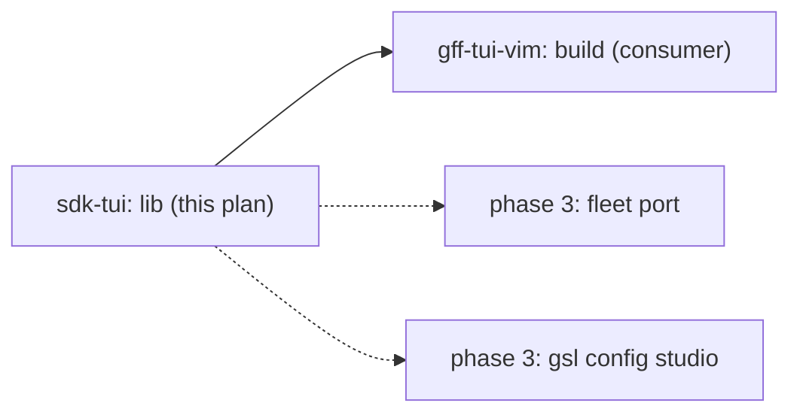

# sdk-tui — shared TUI behaviors for sdk tools — implementation plan

> **For agentic workers:** REQUIRED SUB-SKILL: Use superpowers:subagent-driven-development (recommended) or superpowers:executing-plans to implement this plan task-by-task. Steps use checkbox (`- [ ]`) syntax for tracking. The execution trio lives in [`./sdk-tui/`](./sdk-tui/).

- **Slug:** `sdk-tui`
- **Date:** 2026-09-05
- **Status:** Approved
- **Relates to:** spec [`../specs/sdk-tui.md`](../specs/sdk-tui.md) · design [`../designs/sdk-tui.md`](../designs/sdk-tui.md) · guide `sdk/libs/tui/GUIDE.md` · consumer plan [`./gff-tui-vim.md`](./gff-tui-vim.md) · feature `gss feature sdk-tui`

**Goal:** Ship `sdk/libs/tui` — `keymap`, `nav`, `prompt`, `search`, `cmdline`, `overlay` — as tested, pure, bubbletea-only packages, plus a composition example, so `gff-tui-vim` can build on a frozen API.

**Architecture:** Six small packages inside the existing `sdk/libs` module. Each owns one state machine over ints and strings and takes closures for the tool's edges (row hit test, command bodies, palette). No lipgloss, no I/O, no tool imports. Code is extracted from fleet's shipped TUI (`sdk/fleet/cmd/tui_model.go`, `tui_keys.go`) and the pieces designed for gff.

**Tech Stack:** Go 1.26 toolchain (module directive stays `go 1.24`), bubbletea v1.3.10, testify (add to `libs/go.mod`; `libs/log` tests use the stdlib but testify keeps these tables short).

**Spec:** [`../specs/sdk-tui.md`](../specs/sdk-tui.md)

## Global constraints

- Coverage: each new package ≥ 90%; the `libs` module ≥ 80% under `COVERAGE_ENFORCE=1 ./scripts/test.sh unit`.
- `sdk/libs/go.mod` gains exactly two requirements: `github.com/charmbracelet/bubbletea v1.3.10` and `github.com/stretchr/testify` (test-only). No lipgloss, no bubbles.
- Key names are `tea.KeyMsg.String()` values; `" "` is canonicalized to `"space"` by `keymap.KeyName`. Tests use real key shapes (`KeyRunes` for letters, `KeySpace`, `KeyCtrlD`, `KeyEscape`, `KeyTab`, `KeyShiftTab`, `KeyF1`).
- No package-level mutable state (the fleet `pendingG` global is the bug this rule prevents).
- `make lint-go` clean; `go vet ./...` clean in `sdk/libs`.
- One commit per task, plan message verbatim, session trailers appended; evidence `tee`'d into `docs/mbo/plans/sdk-tui/evidence/<taskN>/` and committed with the task.
- Interfaces in §3 are **frozen** once Task 2 lands: `gff-tui-vim` compiles against them. Changing a signature after that is a TRACKING blocker, not an edit.

---

## 1. Summary & verdict

Extract-and-adopt, approved 2026-09-05 (design §3 option 1). The `:` command line is in
scope (owner decision) even though gff is its first consumer. Verdict: low risk — additive
packages, one new runtime dependency on a module whose other consumers do not import the new
packages (Task 7 records the binary-size proof).

## 2. File inventory

| Path | Purpose | Implements |
| :-- | :-- | :-- |
| `sdk/libs/go.mod`, `go.sum` | + bubbletea, testify | spec §7 |
| `sdk/libs/tui/doc.go` | package overview + link to GUIDE.md | F11 |
| `sdk/libs/tui/GUIDE.md` | design guide (landed in the design PR) | F11 |
| `sdk/libs/tui/prompt/line.go`, `line_test.go` | `Line` editor | F3 |
| `sdk/libs/tui/keymap/keymap.go`, `vim.go`, `keymap_test.go` | `Action`, `Binding`, `Map`, `Vim`, `Dispatch` | F1 |
| `sdk/libs/tui/nav/cursor.go`, `cursor_test.go` | `Cursor` | F2 |
| `sdk/libs/tui/search/search.go`, `search_test.go` | `Compile`, `State` | F4, F5 |
| `sdk/libs/tui/cmdline/cmdline.go`, `cmdline_test.go` | `Parse`, `Registry`, `Standard`, `State` | F6, F7 |
| `sdk/libs/tui/overlay/overlay.go`, `overlay_test.go` | `Palette`, `Plain`, `Help`, `Confirm` | F8, F9 |
| `sdk/libs/tui/example/main.go`, `model.go`, `model_test.go` (build tag `example`) | composition proof | F10 |
| `sdk/libs/AGENTS.md` | package table rows | F11 |
| `sdk/AGENTS.md` | one Conventions line: TUIs read `libs/tui/GUIDE.md` | F11 |
| `docs/mbo/plans/sdk-tui/evidence/**` | gates, demo, deps delta | design §7 |

## 3. Interface contracts (frozen after Task 2)

```go
// ── prompt ──────────────────────────────────────────────────────────────
package prompt
type Line struct { /* runes []rune; pos int */ }
func (l *Line) String() string
func (l *Line) Reset()
func (l *Line) SetText(s string)          // cursor to end
func (l *Line) AtEnd() bool
func (l *Line) Handle(msg tea.KeyMsg) bool // editing keys only; Esc/Enter/Tab/Shift-Tab/Up/Down → false
func (l *Line) Render(cursor string) string

// ── keymap ──────────────────────────────────────────────────────────────
package keymap
type Action string
const ( Up, Down, PageLeft, PageRight, Top, Bottom, HalfUp, HalfDown, PageUp, PageDown,
        Search, NextMatch, PrevMatch, ClearHighlight, Command, Help, Quit, Select, Confirm, Back Action = … )
type Binding struct {
    Action Action
    Keys   []string // KeyMsg.String() names; " " written "space"; "gg" is the chord nav owns
    Help   string   // overlay text
    Short  string   // footer text (defaults to Help)
    Group  string   // footer: bindings sharing a Group render as one item "j/k move"
    Icon   string   // optional
    Header bool     // shown in the footer
}
type Map []Binding
var Vim Map                                 // GUIDE §3
func KeyName(msg tea.KeyMsg) string
func (m Map) Lookup(msg tea.KeyMsg) (Action, bool)
func (m Map) Keys(a Action) []string
func (m Map) Has(key string) bool
func (m Map) Merge(bs ...Binding) Map       // copy; replace by Action in place, else append
func (m Map) Without(as ...Action) Map      // copy
type HelpRow struct { Icon, Keys, Help string; Header bool }
func (m Map) HelpRows() []HelpRow           // Keys joined "/"
func (m Map) HeaderHint(sep string) string  // Header bindings, Group-merged, "keys short" joined by sep
type Handlers map[Action]func() tea.Cmd
func Dispatch(m Map, msg tea.KeyMsg, h Handlers) (handled bool, cmd tea.Cmd)

// ── nav ─────────────────────────────────────────────────────────────────
package nav
type Cursor struct { Pos, Len, Top, Height int /* pendingG bool */ }
func (c *Cursor) SetLen(n int)
func (c *Cursor) SetHeight(h int)
func (c *Cursor) To(i int)                  // clamp + Clamp()
func (c *Cursor) Move(delta int)
func (c *Cursor) Clamp()                    // Top ≤ Pos < Top+Height; Top ≤ max(0, Len-Height)
func (c *Cursor) Visible() (start, end int)
func (c *Cursor) Half() int                 // max(1, Height/2); 5 when Height ≤ 0
func (c *Cursor) Page() int                 // Height; 10 when Height ≤ 0
func (c *Cursor) Apply(a keymap.Action) bool
func (c *Cursor) Pending() bool             // a "g" is waiting for its partner
func (c *Cursor) Key(msg tea.KeyMsg, m keymap.Map) bool

// ── search ──────────────────────────────────────────────────────────────
package search
type Event int
const ( Ignored Event = iota; Typed; Submitted; Cancelled )
type State struct {
    Input     prompt.Line
    Pattern   string          // committed
    Re        *regexp.Regexp  // live or committed
    Err       string
    Matches   []int
    Visible   bool
    AnchorPos, AnchorTop int
}
func Compile(p string) (*regexp.Regexp, error)   // "" → nil,nil; smartcase; error without the "error parsing regexp: " prefix
func (s *State) Start(pos, top int)
func (s *State) Key(msg tea.KeyMsg) Event
func (s *State) Collect(n int, hit func(i int) bool)
func (s *State) First(from int) (int, bool)
func (s *State) Next(cur, dir int) (int, bool)
func (s *State) Commit() (committed, notFound bool)
func (s *State) Cancel() (pos, top int)
func (s *State) Hide()
func (s *State) Rearm() bool
func (s *State) Badge(cur int) string
func (s *State) IsMatch(i int) bool

// ── cmdline ─────────────────────────────────────────────────────────────
package cmdline
var ErrEmpty error
type Command struct { Name string; Args []string }
func Parse(line string) (Command, error)
type Spec struct {
    Name     string
    Aliases  []string
    Help     string
    Run      func(args []string) (tea.Cmd, error)
    Complete func(argIdx int, prefix string) []string // nil = no completion
}
type Registry struct { /* specs []Spec */ }
func (r *Registry) Register(specs ...Spec)
func (r *Registry) Find(name string) (Spec, bool)
func (r *Registry) Run(c Command) (tea.Cmd, error)
func (r *Registry) Specs() []Spec
func Standard(onHelp func(), onSearch func(pattern string)) []Spec
type Kind int
const ( Ignored Kind = iota; Typed; Submitted; Cancelled )
type Event struct { Kind Kind; Command Command }
type State struct { Input prompt.Line /* comp */ }
func (s *State) Key(msg tea.KeyMsg, r *Registry) Event
func (s *State) Complete(dir int, r *Registry)

// ── overlay ─────────────────────────────────────────────────────────────
package overlay
type Palette interface { Dim(string) string; Bold(string) string; Accent(string) string; Err(string) string }
type Plain struct{}
type Section struct { Title string; Lines []string }
func Help(p Palette, title string, m keymap.Map, closeHint string, sections ...Section) string
type Decision int
const ( No Decision = iota; Yes )
type Confirm struct { Title string; Lines []string; YesLabel string; YesKeys, NoKeys []string }
func (c Confirm) Key(msg tea.KeyMsg) Decision
func (c Confirm) Render(p Palette) string
```

## 4. TDD build order

Run every command from `sdk/libs/` unless stated. `EV=../../docs/mbo/plans/sdk-tui/evidence`.
Work inside the `lib` worker worktree (IMPLEMENTATION §2).

### Task 1: module wiring + `prompt.Line`

**Files:**
- Modify: `sdk/libs/go.mod` (+ bubbletea, testify), `go.sum`
- Create: `sdk/libs/tui/doc.go`, `sdk/libs/tui/prompt/line.go`
- Test: `sdk/libs/tui/prompt/line_test.go`

**Interfaces:** Produces `prompt.Line` per §3 (consumed by Tasks 4, 5).

- [ ] **Step 1: Write the failing test**

```go
package prompt

import (
	"testing"

	tea "github.com/charmbracelet/bubbletea"
	"github.com/stretchr/testify/assert"
)

func runes(s string) tea.KeyMsg { return tea.KeyMsg{Type: tea.KeyRunes, Runes: []rune(s)} }
func key(t tea.KeyType) tea.KeyMsg { return tea.KeyMsg{Type: t} }

func TestLineEditing(t *testing.T) {
	cases := []struct {
		name string
		keys []tea.KeyMsg
		want string
		pos  int
	}{
		{"insert", []tea.KeyMsg{runes("ab"), runes("c")}, "abc", 3},
		{"space is a rune", []tea.KeyMsg{runes("a"), key(tea.KeySpace), runes("b")}, "a b", 3},
		{"unicode", []tea.KeyMsg{runes("héllo")}, "héllo", 5},
		{"backspace", []tea.KeyMsg{runes("abc"), key(tea.KeyBackspace)}, "ab", 2},
		{"backspace at start is a no-op", []tea.KeyMsg{key(tea.KeyBackspace)}, "", 0},
		{"left then insert", []tea.KeyMsg{runes("ac"), key(tea.KeyLeft), runes("b")}, "abc", 2},
		{"delete under cursor", []tea.KeyMsg{runes("abc"), key(tea.KeyHome), key(tea.KeyDelete)}, "bc", 0},
		{"home/end", []tea.KeyMsg{runes("abc"), key(tea.KeyHome), runes("x"), key(tea.KeyEnd), runes("y")}, "xabcy", 5},
		{"ctrl+a / ctrl+e", []tea.KeyMsg{runes("abc"), key(tea.KeyCtrlA), runes("x"), key(tea.KeyCtrlE), runes("y")}, "xabcy", 5},
		{"ctrl+u kills to start", []tea.KeyMsg{runes("abc def"), key(tea.KeyLeft), key(tea.KeyCtrlU)}, "f", 0},
		{"ctrl+w kills a word", []tea.KeyMsg{runes("set install.ai "), key(tea.KeyCtrlW)}, "set ", 4},
		{"right clamps", []tea.KeyMsg{runes("a"), key(tea.KeyRight), key(tea.KeyRight), runes("b")}, "ab", 2},
	}
	for _, tc := range cases {
		t.Run(tc.name, func(t *testing.T) {
			var l Line
			for _, k := range tc.keys {
				assert.True(t, l.Handle(k), "editing keys are consumed")
			}
			assert.Equal(t, tc.want, l.String())
			assert.Equal(t, tc.pos, l.pos)
		})
	}
}

func TestLineDoesNotConsumeModeKeys(t *testing.T) {
	var l Line
	for _, k := range []tea.KeyType{tea.KeyEscape, tea.KeyEnter, tea.KeyTab, tea.KeyShiftTab, tea.KeyUp, tea.KeyDown} {
		assert.False(t, l.Handle(key(k)), "%v belongs to the owning mode", k)
	}
}

func TestLineRenderResetAtEnd(t *testing.T) {
	var l Line
	l.SetText("abc")
	assert.True(t, l.AtEnd())
	l.Handle(key(tea.KeyLeft))
	assert.False(t, l.AtEnd())
	assert.Equal(t, "ab▌c", l.Render("▌"))
	l.Reset()
	assert.Equal(t, "", l.String())
	assert.Equal(t, "▌", l.Render("▌"))
}
```

- [ ] **Step 2: Run test to verify it fails**

Run: `go get github.com/charmbracelet/bubbletea@v1.3.10 github.com/stretchr/testify@latest && go test ./tui/prompt/ 2>&1 | head -5`
Expected: FAIL — `undefined: Line`.

- [ ] **Step 3: Write minimal implementation**

`tui/doc.go`:

```go
// Package tui is the umbrella for the shared TUI behaviors every sdk tool
// composes: keymap (data-driven keys + dispatch), nav (cursor/viewport),
// prompt (line editor), search (incremental smartcase regex), cmdline
// (ex-style commands + completion), overlay (help + confirm).
//
// Read GUIDE.md in this directory before writing or changing a TUI. The
// packages are pure: they own state over ints and strings, take closures for
// the tool's edges, and never touch disk, network, colors, or tool types.
package tui
```

`tui/prompt/line.go`:

```go
// Package prompt is the single-line editor behind / and : prompts.
package prompt

import tea "github.com/charmbracelet/bubbletea"

// Line is an editable rune buffer with a cursor. It owns only editing keys;
// Esc/Enter/Tab/Shift-Tab/Up/Down are the owning mode's business.
type Line struct {
	runes []rune
	pos   int
}

func (l *Line) String() string { return string(l.runes) }

func (l *Line) Reset() { l.runes, l.pos = l.runes[:0], 0 }

// SetText replaces the buffer and parks the cursor at the end.
func (l *Line) SetText(s string) { l.runes = []rune(s); l.pos = len(l.runes) }

// AtEnd reports whether the cursor sits after the last rune (completion only
// makes sense there).
func (l *Line) AtEnd() bool { return l.pos == len(l.runes) }

// Render is the text with the cursor glyph at the insertion point.
func (l *Line) Render(cursor string) string {
	return string(l.runes[:l.pos]) + cursor + string(l.runes[l.pos:])
}

// Handle applies one editing key and reports whether it consumed it.
func (l *Line) Handle(msg tea.KeyMsg) bool {
	switch msg.Type {
	case tea.KeyRunes:
		l.insert(msg.Runes)
	case tea.KeySpace:
		l.insert([]rune{' '})
	case tea.KeyBackspace:
		if l.pos > 0 {
			l.runes = append(l.runes[:l.pos-1], l.runes[l.pos:]...)
			l.pos--
		}
	case tea.KeyDelete:
		if l.pos < len(l.runes) {
			l.runes = append(l.runes[:l.pos], l.runes[l.pos+1:]...)
		}
	case tea.KeyLeft:
		if l.pos > 0 {
			l.pos--
		}
	case tea.KeyRight:
		if l.pos < len(l.runes) {
			l.pos++
		}
	case tea.KeyHome, tea.KeyCtrlA:
		l.pos = 0
	case tea.KeyEnd, tea.KeyCtrlE:
		l.pos = len(l.runes)
	case tea.KeyCtrlU:
		l.runes = append([]rune{}, l.runes[l.pos:]...)
		l.pos = 0
	case tea.KeyCtrlW:
		start := l.pos
		for start > 0 && l.runes[start-1] == ' ' {
			start--
		}
		for start > 0 && l.runes[start-1] != ' ' {
			start--
		}
		l.runes = append(l.runes[:start], l.runes[l.pos:]...)
		l.pos = start
	default:
		return false
	}
	return true
}

func (l *Line) insert(rs []rune) {
	out := make([]rune, 0, len(l.runes)+len(rs))
	out = append(out, l.runes[:l.pos]...)
	out = append(out, rs...)
	out = append(out, l.runes[l.pos:]...)
	l.runes = out
	l.pos += len(rs)
}
```

- [ ] **Step 4: Run test to verify it passes**

Run: `mkdir -p $EV/task1 && go test ./tui/... -cover -v 2>&1 | tee $EV/task1/go-test.txt | grep -E '^(ok|FAIL|---)'`
Expected: `ok … tui/prompt … coverage: ≥ 90%`.

- [ ] **Step 5: Commit**

```bash
git add go.mod go.sum tui/doc.go tui/prompt/line.go tui/prompt/line_test.go ../../docs/mbo/plans/sdk-tui/evidence/task1
git commit -m "feat(libs/tui): module wiring + prompt.Line single-line editor"
```

---

### Task 2: `keymap` — actions, bindings, Vim map, dispatch

**Files:**
- Create: `sdk/libs/tui/keymap/keymap.go`, `sdk/libs/tui/keymap/vim.go`
- Test: `sdk/libs/tui/keymap/keymap_test.go`

**Interfaces:** Produces `keymap` per §3 (consumed by Tasks 3, 6, and every tool).

- [ ] **Step 1: Write the failing test**

```go
package keymap

import (
	"testing"

	tea "github.com/charmbracelet/bubbletea"
	"github.com/stretchr/testify/assert"
	"github.com/stretchr/testify/require"
)

func k(t tea.KeyType) tea.KeyMsg  { return tea.KeyMsg{Type: t} }
func r(s string) tea.KeyMsg       { return tea.KeyMsg{Type: tea.KeyRunes, Runes: []rune(s)} }

func TestLookupUsesRealKeyNames(t *testing.T) {
	cases := []struct {
		msg  tea.KeyMsg
		want Action
	}{
		{r("j"), Down}, {k(tea.KeyDown), Down}, {r("k"), Up},
		{r("h"), PageLeft}, {k(tea.KeyRight), PageRight},
		{r("G"), Bottom}, {k(tea.KeyCtrlD), HalfDown}, {k(tea.KeyCtrlU), HalfUp},
		{k(tea.KeyCtrlF), PageDown}, {k(tea.KeyPgDown), PageDown}, {k(tea.KeyCtrlB), PageUp}, {k(tea.KeyPgUp), PageUp},
		{r("/"), Search}, {r("n"), NextMatch}, {r("N"), PrevMatch}, {k(tea.KeyEscape), ClearHighlight},
		{r(":"), Command}, {r("?"), Help}, {k(tea.KeyF1), Help}, {r("q"), Quit}, {k(tea.KeyCtrlC), Quit},
		{k(tea.KeySpace), Select}, {r(" "), Select}, {k(tea.KeyEnter), Confirm},
	}
	for _, tc := range cases {
		got, ok := Vim.Lookup(tc.msg)
		require.True(t, ok, "%s must be bound", tc.msg)
		assert.Equal(t, tc.want, got, tc.msg.String())
	}
	_, ok := Vim.Lookup(r("z"))
	assert.False(t, ok)
	_, ok = Vim.Lookup(r("g")) // gg is a chord owned by nav, not a Lookup hit
	assert.False(t, ok)
	assert.True(t, Vim.Has("gg"))
}

func TestMergeReplacesInPlaceOrAppends(t *testing.T) {
	m := Vim.Merge(
		Binding{Action: PageRight, Keys: []string{"l"}, Help: "open the log pane"},
		Binding{Action: "refresh", Keys: []string{"r"}, Help: "refresh"},
	)
	assert.Equal(t, len(Vim)+1, len(m))
	i := indexOf(m, PageRight)
	assert.Equal(t, indexOf(Vim, PageRight), i, "replaced in place")
	assert.Equal(t, "open the log pane", m[i].Help)
	assert.Equal(t, "refresh", string(m[len(m)-1].Action))
	assert.NotEqual(t, "open the log pane", Vim[indexOf(Vim, PageRight)].Help, "Vim is never mutated")
}

func TestWithoutRemovesActions(t *testing.T) {
	m := Vim.Without(PageLeft, PageRight, "absent")
	assert.Equal(t, len(Vim)-2, len(m))
	_, ok := m.Lookup(r("h"))
	assert.False(t, ok)
	assert.Nil(t, m.Keys(PageLeft))
	assert.Equal(t, []string{"j", "down"}, m.Keys(Down))
}

func TestHeaderHintGroupsAndOrders(t *testing.T) {
	m := Map{
		{Action: Down, Keys: []string{"j", "down"}, Short: "move", Group: "move", Header: true},
		{Action: Up, Keys: []string{"k", "up"}, Short: "move", Group: "move", Header: true},
		{Action: Top, Keys: []string{"gg"}, Help: "first row"},
		{Action: Search, Keys: []string{"/"}, Help: "regex search", Short: "search", Header: true},
		{Action: Quit, Keys: []string{"q", "ctrl+c"}, Help: "quit", Header: true},
	}
	assert.Equal(t, "j/k move  / search  q quit", m.HeaderHint("  "))
	assert.Equal(t, "", Map{}.HeaderHint("  "))
	assert.Equal(t, "j/k move  h/l page  / search  n/N match  : command  ? help  q quit", Vim.HeaderHint("  "))
}

func TestHelpRowsJoinKeys(t *testing.T) {
	rows := Vim.HelpRows()
	assert.Equal(t, len(Vim), len(rows))
	assert.Equal(t, "j/down", rows[indexOf(Vim, Down)].Keys)
	assert.Equal(t, "gg", rows[indexOf(Vim, Top)].Keys)
}

func TestDispatchCallsTheBoundHandlerOnce(t *testing.T) {
	calls := 0
	h := Handlers{Quit: func() tea.Cmd { calls++; return tea.Quit }}
	handled, cmd := Dispatch(Vim, r("q"), h)
	assert.True(t, handled)
	assert.NotNil(t, cmd)
	assert.Equal(t, 1, calls)
	handled, _ = Dispatch(Vim, r("j"), h) // bound, no handler
	assert.False(t, handled)
	handled, _ = Dispatch(Vim, r("z"), h) // unbound
	assert.False(t, handled)
}

func indexOf(m Map, a Action) int {
	for i, b := range m {
		if b.Action == a {
			return i
		}
	}
	return -1
}
```

- [ ] **Step 2: Run test to verify it fails**

Run: `go test ./tui/keymap/ 2>&1 | head -5`
Expected: FAIL — `undefined: Vim`.

- [ ] **Step 3: Write minimal implementation**

`tui/keymap/keymap.go`:

```go
// Package keymap makes a TUI's keys data: an ordered table of bindings that
// renders its own footer and help, looks up actions from real key events, and
// dispatches to handlers. Keys are bubbletea KeyMsg.String() names.
package keymap

import (
	"strings"

	tea "github.com/charmbracelet/bubbletea"
)

// Action names what a key does. Tools add their own ("toggle", "refresh").
type Action string

// The canonical actions (GUIDE.md §3).
const (
	Up             Action = "up"
	Down           Action = "down"
	PageLeft       Action = "page-left"
	PageRight      Action = "page-right"
	Top            Action = "top"
	Bottom         Action = "bottom"
	HalfUp         Action = "half-up"
	HalfDown       Action = "half-down"
	PageUp         Action = "page-up"
	PageDown       Action = "page-down"
	Search         Action = "search"
	NextMatch      Action = "next-match"
	PrevMatch      Action = "prev-match"
	ClearHighlight Action = "clear-highlight"
	Command        Action = "command"
	Help           Action = "help"
	Quit           Action = "quit"
	Select         Action = "select"
	Confirm        Action = "confirm"
	Back           Action = "back"
)

// Binding is one row of the key table.
type Binding struct {
	Action Action
	Keys   []string // KeyMsg.String() names; " " is written "space"; "gg" is the chord nav owns
	Help   string   // overlay text
	Short  string   // footer text; defaults to Help
	Group  string   // footer: bindings sharing a Group render as one item ("j/k move")
	Icon   string   // optional glyph for the overlay
	Header bool     // shown in the footer
}

// Map is an ordered key table. Order is presentation order.
type Map []Binding

// KeyName canonicalizes a key event to the name used in Binding.Keys.
func KeyName(msg tea.KeyMsg) string {
	if s := msg.String(); s != " " {
		return s
	}
	return "space"
}

// Lookup returns the action bound to the key event.
func (m Map) Lookup(msg tea.KeyMsg) (Action, bool) {
	name := KeyName(msg)
	for _, b := range m {
		for _, k := range b.Keys {
			if k == name {
				return b.Action, true
			}
		}
	}
	return "", false
}

// Keys returns the keys bound to an action (nil when unbound).
func (m Map) Keys(a Action) []string {
	for _, b := range m {
		if b.Action == a {
			return b.Keys
		}
	}
	return nil
}

// Has reports whether any binding lists the key name (chords included).
func (m Map) Has(key string) bool {
	for _, b := range m {
		for _, k := range b.Keys {
			if k == key {
				return true
			}
		}
	}
	return false
}

// Merge returns a copy with each binding replaced in place (same Action) or
// appended. The receiver is never mutated.
func (m Map) Merge(bs ...Binding) Map {
	out := append(Map(nil), m...)
	for _, nb := range bs {
		replaced := false
		for i := range out {
			if out[i].Action == nb.Action {
				out[i] = nb
				replaced = true
				break
			}
		}
		if !replaced {
			out = append(out, nb)
		}
	}
	return out
}

// Without returns a copy with the actions removed.
func (m Map) Without(as ...Action) Map {
	drop := map[Action]bool{}
	for _, a := range as {
		drop[a] = true
	}
	out := make(Map, 0, len(m))
	for _, b := range m {
		if !drop[b.Action] {
			out = append(out, b)
		}
	}
	return out
}

// HelpRow is one overlay line.
type HelpRow struct {
	Icon, Keys, Help string
	Header           bool
}

// HelpRows renders every binding for the help overlay, keys joined by "/".
func (m Map) HelpRows() []HelpRow {
	rows := make([]HelpRow, len(m))
	for i, b := range m {
		rows[i] = HelpRow{Icon: b.Icon, Keys: strings.Join(b.Keys, "/"), Help: b.Help, Header: b.Header}
	}
	return rows
}

// HeaderHint renders the footer strip from Header bindings in table order.
// Bindings sharing a Group collapse into one item whose keys are each
// member's primary key ("j/k move").
func (m Map) HeaderHint(sep string) string {
	type item struct{ keys, short string }
	var items []item
	groupAt := map[string]int{}
	for _, b := range m {
		if !b.Header || len(b.Keys) == 0 {
			continue
		}
		short := b.Short
		if short == "" {
			short = b.Help
		}
		if b.Group != "" {
			if i, ok := groupAt[b.Group]; ok {
				items[i].keys += "/" + b.Keys[0]
				continue
			}
			groupAt[b.Group] = len(items)
		}
		items = append(items, item{keys: b.Keys[0], short: short})
	}
	parts := make([]string, len(items))
	for i, it := range items {
		parts[i] = it.keys + " " + it.short
	}
	return strings.Join(parts, sep)
}

// Handlers binds actions to behavior.
type Handlers map[Action]func() tea.Cmd

// Dispatch looks the key up and runs its handler. handled is false when the
// key is unbound or the action has no handler, so callers can fall through.
func Dispatch(m Map, msg tea.KeyMsg, h Handlers) (bool, tea.Cmd) {
	a, ok := m.Lookup(msg)
	if !ok {
		return false, nil
	}
	fn, ok := h[a]
	if !ok {
		return false, nil
	}
	return true, fn()
}
```

`tui/keymap/vim.go`:

```go
package keymap

// Vim is the canonical sdk keymap (GUIDE.md §3). Tools extend it with Merge
// and trim it with Without; they do not rebind these keys.
var Vim = Map{
	{Action: Down, Keys: []string{"j", "down"}, Help: "move down", Short: "move", Group: "move", Header: true},
	{Action: Up, Keys: []string{"k", "up"}, Help: "move up", Short: "move", Group: "move", Header: true},
	{Action: PageLeft, Keys: []string{"h", "left"}, Help: "previous page / pane", Short: "page", Group: "page", Header: true},
	{Action: PageRight, Keys: []string{"l", "right"}, Help: "next page / pane", Short: "page", Group: "page", Header: true},
	{Action: Top, Keys: []string{"gg"}, Help: "first row"},
	{Action: Bottom, Keys: []string{"G"}, Help: "last row"},
	{Action: HalfDown, Keys: []string{"ctrl+d"}, Help: "half page down"},
	{Action: HalfUp, Keys: []string{"ctrl+u"}, Help: "half page up"},
	{Action: PageDown, Keys: []string{"ctrl+f", "pgdown"}, Help: "page down"},
	{Action: PageUp, Keys: []string{"ctrl+b", "pgup"}, Help: "page up"},
	{Action: Search, Keys: []string{"/"}, Help: "regex search (smartcase; enter commit, esc cancel)", Short: "search", Header: true},
	{Action: NextMatch, Keys: []string{"n"}, Help: "next match", Short: "match", Group: "match", Header: true},
	{Action: PrevMatch, Keys: []string{"N"}, Help: "previous match", Short: "match", Group: "match", Header: true},
	{Action: ClearHighlight, Keys: []string{"esc"}, Help: "clear search highlights (pattern kept for n/N)"},
	{Action: Command, Keys: []string{":"}, Help: "command line", Short: "command", Header: true},
	{Action: Help, Keys: []string{"?", "f1"}, Help: "this help", Short: "help", Header: true},
	{Action: Quit, Keys: []string{"q", "ctrl+c"}, Help: "quit", Header: true},
	{Action: Select, Keys: []string{"space"}, Help: "select / toggle the row"},
	{Action: Confirm, Keys: []string{"enter"}, Help: "open / confirm"},
}
```

- [ ] **Step 4: Run test to verify it passes**

Run: `mkdir -p $EV/task2 && go test ./tui/keymap/ -cover -v 2>&1 | tee $EV/task2/go-test.txt | grep -E '^(ok|FAIL|---)'`
Expected: `ok`, ≥ 90%.

- [ ] **Step 5: Commit**

```bash
git add tui/keymap ../../docs/mbo/plans/sdk-tui/evidence/task2
git commit -m "feat(libs/tui): keymap — data-driven bindings, Vim default map, footer/help rows, dispatch"
```

---

### Task 3: `nav.Cursor` — cursor + viewport + `gg` chord

**Files:**
- Create: `sdk/libs/tui/nav/cursor.go`
- Test: `sdk/libs/tui/nav/cursor_test.go`

**Interfaces:** Consumes `keymap`. Produces `nav.Cursor` per §3.

- [ ] **Step 1: Write the failing test**

```go
package nav

import (
	"testing"

	tea "github.com/charmbracelet/bubbletea"
	"github.com/sfc-gh-eraigosa/dotfiles/sdk/libs/tui/keymap"
	"github.com/stretchr/testify/assert"
)

func r(s string) tea.KeyMsg  { return tea.KeyMsg{Type: tea.KeyRunes, Runes: []rune(s)} }
func k(t tea.KeyType) tea.KeyMsg { return tea.KeyMsg{Type: t} }

func TestMoveClampsBothEnds(t *testing.T) {
	c := Cursor{Len: 5, Height: 3}
	c.Move(-1)
	assert.Equal(t, 0, c.Pos)
	c.Move(10)
	assert.Equal(t, 4, c.Pos)
	c.Move(-2)
	assert.Equal(t, 2, c.Pos)
}

func TestEmptyListNeverPanics(t *testing.T) {
	var c Cursor
	c.Move(1)
	c.To(7)
	c.Key(r("G"), keymap.Vim)
	c.Key(r("g"), keymap.Vim)
	c.Key(r("g"), keymap.Vim)
	assert.Equal(t, 0, c.Pos)
	assert.Equal(t, 0, c.Top)
	s, e := c.Visible()
	assert.Equal(t, 0, s)
	assert.Equal(t, 0, e)
}

func TestClampKeepsCursorOnScreen(t *testing.T) {
	c := Cursor{Len: 10, Height: 3}
	c.To(5)
	assert.Equal(t, 3, c.Top, "viewport scrolls so Pos is the last visible row")
	c.To(1)
	assert.Equal(t, 1, c.Top, "scrolls back up to Pos")
	c.To(9)
	assert.Equal(t, 7, c.Top, "Top never exceeds Len-Height")
	c.SetLen(4)
	assert.Equal(t, 3, c.Pos, "SetLen clamps Pos")
	assert.Equal(t, 1, c.Top)
	s, e := c.Visible()
	assert.Equal(t, 1, s)
	assert.Equal(t, 4, e)
}

func TestStridesFallBackWhenHeightUnknown(t *testing.T) {
	var c Cursor
	assert.Equal(t, 5, c.Half())
	assert.Equal(t, 10, c.Page())
	c.SetHeight(1)
	assert.Equal(t, 1, c.Half())
	assert.Equal(t, 1, c.Page())
	c.SetHeight(8)
	assert.Equal(t, 4, c.Half())
	assert.Equal(t, 8, c.Page())
}

func TestApplyActions(t *testing.T) {
	c := Cursor{Len: 30, Height: 8}
	assert.True(t, c.Apply(keymap.HalfDown))
	assert.Equal(t, 4, c.Pos)
	assert.True(t, c.Apply(keymap.PageDown))
	assert.Equal(t, 12, c.Pos)
	assert.True(t, c.Apply(keymap.Bottom))
	assert.Equal(t, 29, c.Pos)
	assert.True(t, c.Apply(keymap.PageUp))
	assert.Equal(t, 21, c.Pos)
	assert.True(t, c.Apply(keymap.HalfUp))
	assert.Equal(t, 17, c.Pos)
	assert.True(t, c.Apply(keymap.Top))
	assert.Equal(t, 0, c.Pos)
	assert.True(t, c.Apply(keymap.Down))
	assert.True(t, c.Apply(keymap.Up))
	assert.Equal(t, 0, c.Pos)
	assert.False(t, c.Apply(keymap.Search), "non-motion actions are not consumed")
}

func TestGGChordAndCancellation(t *testing.T) {
	c := Cursor{Len: 10, Height: 5}
	c.To(9)
	assert.True(t, c.Key(r("g"), keymap.Vim))
	assert.True(t, c.Pending())
	assert.Equal(t, 9, c.Pos, "a lone g moves nothing")
	assert.True(t, c.Key(r("g"), keymap.Vim))
	assert.Equal(t, 0, c.Pos, "gg = top")
	assert.False(t, c.Pending())

	c.To(9)
	assert.True(t, c.Key(r("g"), keymap.Vim))
	assert.True(t, c.Key(r("k"), keymap.Vim), "k cancels the pending g AND moves")
	assert.Equal(t, 8, c.Pos)
	assert.False(t, c.Pending())

	c.Key(r("g"), keymap.Vim)
	assert.False(t, c.Key(r("/"), keymap.Vim), "a non-motion key cancels the chord and is NOT consumed")
	assert.False(t, c.Pending())
}

func TestKeyWithoutChordInMap(t *testing.T) {
	m := keymap.Vim.Without(keymap.Top)
	c := Cursor{Len: 3}
	assert.False(t, c.Key(r("g"), m), "no gg binding → g is not a chord")
	assert.True(t, c.Key(k(tea.KeyDown), m))
	assert.Equal(t, 1, c.Pos)
}
```

- [ ] **Step 2: Run test to verify it fails**

Run: `go test ./tui/nav/ 2>&1 | head -5`
Expected: FAIL — `undefined: Cursor`.

- [ ] **Step 3: Write minimal implementation**

```go
// Package nav is the cursor + viewport engine every list TUI needs: clamped
// motion, a viewport that follows the cursor, half/full page strides, and the
// gg chord — all as a value, never a package global.
package nav

import (
	tea "github.com/charmbracelet/bubbletea"
	"github.com/sfc-gh-eraigosa/dotfiles/sdk/libs/tui/keymap"
)

// Cursor tracks the selected row and the visible window over Len rows.
type Cursor struct {
	Pos, Len    int
	Top, Height int
	pendingG    bool
}

// SetLen updates the row count and clamps the cursor.
func (c *Cursor) SetLen(n int) {
	c.Len = n
	c.To(c.Pos)
}

// SetHeight updates the visible row budget and re-clamps the viewport.
func (c *Cursor) SetHeight(h int) {
	c.Height = h
	c.Clamp()
}

// To moves to row i, clamped to the list, and keeps it visible.
func (c *Cursor) To(i int) {
	if c.Len <= 0 {
		c.Pos, c.Top = 0, 0
		return
	}
	if i < 0 {
		i = 0
	}
	if i > c.Len-1 {
		i = c.Len - 1
	}
	c.Pos = i
	c.Clamp()
}

// Move moves by delta rows.
func (c *Cursor) Move(delta int) { c.To(c.Pos + delta) }

// Clamp enforces Top <= Pos < Top+Height and Top <= max(0, Len-Height)
// (extracted from fleet's clampViewport).
func (c *Cursor) Clamp() {
	h := c.Height
	if h < 1 {
		c.Top = 0
		return
	}
	if c.Pos < c.Top {
		c.Top = c.Pos
	}
	if c.Pos >= c.Top+h {
		c.Top = c.Pos - h + 1
	}
	if max := c.Len - h; c.Top > max {
		c.Top = max
	}
	if c.Top < 0 {
		c.Top = 0
	}
}

// Visible is the [start, end) row range to render.
func (c *Cursor) Visible() (int, int) {
	if c.Len <= 0 {
		return 0, 0
	}
	end := c.Len
	if c.Height > 0 && c.Top+c.Height < end {
		end = c.Top + c.Height
	}
	return c.Top, end
}

// Half is the ctrl+d / ctrl+u stride.
func (c *Cursor) Half() int {
	if c.Height <= 0 {
		return 5
	}
	if n := c.Height / 2; n > 0 {
		return n
	}
	return 1
}

// Page is the ctrl+f / ctrl+b stride.
func (c *Cursor) Page() int {
	if c.Height <= 0 {
		return 10
	}
	return c.Height
}

// Apply performs a motion action; false means "not a motion".
func (c *Cursor) Apply(a keymap.Action) bool {
	switch a {
	case keymap.Up:
		c.Move(-1)
	case keymap.Down:
		c.Move(1)
	case keymap.Top:
		c.To(0)
	case keymap.Bottom:
		c.To(c.Len - 1)
	case keymap.HalfUp:
		c.Move(-c.Half())
	case keymap.HalfDown:
		c.Move(c.Half())
	case keymap.PageUp:
		c.Move(-c.Page())
	case keymap.PageDown:
		c.Move(c.Page())
	default:
		return false
	}
	return true
}

// Pending reports whether a "g" is waiting for its partner.
func (c *Cursor) Pending() bool { return c.pendingG }

// Key routes a key event: the gg chord first (only when the map binds "gg"),
// then motion actions. A non-motion key cancels a pending g and is NOT
// consumed, so the caller handles it normally.
func (c *Cursor) Key(msg tea.KeyMsg, m keymap.Map) bool {
	name := keymap.KeyName(msg)
	if c.pendingG {
		c.pendingG = false
		if name == "g" {
			c.To(0)
			return true
		}
	} else if name == "g" && m.Has("gg") {
		c.pendingG = true
		return true
	}
	if a, ok := m.Lookup(msg); ok {
		return c.Apply(a)
	}
	return false
}
```

- [ ] **Step 4: Run test to verify it passes**

Run: `mkdir -p $EV/task3 && go test ./tui/nav/ -cover -v 2>&1 | tee $EV/task3/go-test.txt | grep -E '^(ok|FAIL|---)'`
Expected: `ok`, ≥ 90%.

- [ ] **Step 5: Commit**

```bash
git add tui/nav ../../docs/mbo/plans/sdk-tui/evidence/task3
git commit -m "feat(libs/tui): nav.Cursor — clamped motion, following viewport, gg chord as state"
```

---

### Task 4: `search` — smartcase compile + the `/` state machine

**Files:**
- Create: `sdk/libs/tui/search/search.go`
- Test: `sdk/libs/tui/search/search_test.go`

**Interfaces:** Consumes `prompt.Line`. Produces `search` per §3.

- [ ] **Step 1: Write the failing test**

```go
package search

import (
	"testing"

	tea "github.com/charmbracelet/bubbletea"
	"github.com/stretchr/testify/assert"
	"github.com/stretchr/testify/require"
)

func r(s string) tea.KeyMsg  { return tea.KeyMsg{Type: tea.KeyRunes, Runes: []rune(s)} }
func k(t tea.KeyType) tea.KeyMsg { return tea.KeyMsg{Type: t} }

var rows = []string{"install.ai.claude Claude CLI", "install.ai.teams AI teams", "install.pkg.manager Package manager", "shell.zsh Zsh"}

func hit(s *State) func(int) bool {
	return func(i int) bool { return s.Re != nil && s.Re.MatchString(rows[i]) }
}

func typeInto(s *State, text string) {
	for _, c := range text {
		s.Key(r(string(c)))
	}
}

func TestCompileSmartcaseAndErrors(t *testing.T) {
	re, err := Compile("claude")
	require.NoError(t, err)
	assert.True(t, re.MatchString("Claude CLI"))
	re, err = Compile("Claude")
	require.NoError(t, err)
	assert.False(t, re.MatchString("claude"))
	re, err = Compile("")
	require.NoError(t, err)
	assert.Nil(t, re)
	_, err = Compile("[ai")
	require.Error(t, err)
	assert.Equal(t, "missing closing ]: `[ai`", err.Error(), "parser prefix stripped, fragment kept")
	re, err = Compile("\\.\\(")
	require.NoError(t, err)
	assert.True(t, re.MatchString("A.("), "symbols-only pattern is case-insensitive and still valid")
}

func TestTypingRecomputesAndInvalidKeepsPreviousRe(t *testing.T) {
	var s State
	s.Start(0, 0)
	typeInto(&s, "ai")
	s.Collect(len(rows), hit(&s))
	assert.Equal(t, []int{0, 1}, s.Matches)
	assert.Equal(t, Typed, s.Key(r("[")))
	assert.Contains(t, s.Err, "missing closing ]")
	s.Collect(len(rows), hit(&s))
	assert.Equal(t, []int{0, 1}, s.Matches, "previous Re kept")
	s.Key(k(tea.KeyBackspace))
	assert.Equal(t, "", s.Err)
}

func TestModeKeysAreIgnoredNotTyped(t *testing.T) {
	var s State
	s.Start(0, 0)
	assert.Equal(t, Ignored, s.Key(k(tea.KeyTab)))
	assert.Equal(t, Typed, s.Key(r("q")))
	assert.Equal(t, "q", s.Input.String())
}

func TestFirstAndNextWrap(t *testing.T) {
	var s State
	s.Start(2, 0)
	typeInto(&s, "install")
	s.Collect(len(rows), hit(&s))
	i, ok := s.First(2)
	assert.True(t, ok)
	assert.Equal(t, 2, i, "first match at or after the anchor")
	i, _ = s.First(3)
	assert.Equal(t, 0, i, "wraps to the top")
	i, _ = s.Next(2, 1)
	assert.Equal(t, 0, i)
	i, _ = s.Next(0, -1)
	assert.Equal(t, 2, i)
	var empty State
	_, ok = empty.Next(0, 1)
	assert.False(t, ok)
}

func TestCommitCancelHideRearmBadge(t *testing.T) {
	var s State
	s.Start(3, 1)
	typeInto(&s, "ai")
	s.Collect(len(rows), hit(&s))
	assert.Equal(t, Submitted, s.Key(k(tea.KeyEnter)))
	committed, notFound := s.Commit()
	assert.True(t, committed)
	assert.False(t, notFound)
	assert.Equal(t, "ai", s.Pattern)
	assert.Equal(t, "", s.Input.String())
	assert.Equal(t, "/ai [1/2]", s.Badge(0))
	assert.Equal(t, "/ai [-/2]", s.Badge(3))
	assert.True(t, s.IsMatch(1))

	s.Hide()
	assert.False(t, s.Visible)
	assert.Equal(t, "", s.Badge(0))
	assert.Equal(t, "ai", s.Pattern, "pattern survives :noh")
	assert.True(t, s.Rearm())
	assert.True(t, s.Visible)
	s.Collect(len(rows), hit(&s))
	assert.Equal(t, []int{0, 1}, s.Matches)

	s.Start(2, 0)
	typeInto(&s, "zzz")
	s.Collect(len(rows), hit(&s))
	committed, notFound = s.Commit()
	assert.True(t, committed)
	assert.True(t, notFound)

	s.Start(2, 5)
	typeInto(&s, "[")
	committed, _ = s.Commit()
	assert.False(t, committed, "an outstanding error refuses to commit")
	assert.Equal(t, "zzz", s.Pattern)
	assert.Equal(t, Cancelled, s.Key(k(tea.KeyEscape)))
	pos, top := s.Cancel()
	assert.Equal(t, 2, pos)
	assert.Equal(t, 5, top)
	assert.Nil(t, s.Re)
	assert.Equal(t, "zzz", s.Pattern)

	var fresh State
	assert.False(t, fresh.Rearm(), "nothing to re-arm")
	s.Start(0, 0)
	committed, _ = s.Commit()
	assert.True(t, committed, "empty commit hides and clears the pattern")
	assert.Equal(t, "", s.Pattern)
}
```

- [ ] **Step 2: Run test to verify it fails**

Run: `go test ./tui/search/ 2>&1 | head -5`
Expected: FAIL — `undefined: Compile`.

- [ ] **Step 3: Write minimal implementation**

```go
// Package search is the / prompt state machine: incremental smartcase regex,
// match collection over the caller's rows, n/N with wrap, :noh and re-arm.
package search

import (
	"regexp"
	"strconv"
	"strings"
	"unicode"

	tea "github.com/charmbracelet/bubbletea"
	"github.com/sfc-gh-eraigosa/dotfiles/sdk/libs/tui/prompt"
)

// Event is what a key did to the prompt.
type Event int

const (
	Ignored Event = iota
	Typed
	Submitted
	Cancelled
)

// State is the search prompt plus the committed pattern n/N replay.
type State struct {
	Input     prompt.Line
	Pattern   string         // committed pattern (n/N)
	Re        *regexp.Regexp // live or committed pattern
	Err       string         // live compile error
	Matches   []int          // matching row indices, ascending
	Visible   bool           // highlights + badge shown
	AnchorPos int            // cursor when / was pressed
	AnchorTop int            // viewport top when / was pressed
	set       map[int]bool
}

// Compile applies vim smartcase: an empty pattern is nil (no matches, no
// error); a pattern with no uppercase letter is case-insensitive. Error text
// drops Go's "error parsing regexp: " prefix ("missing closing ]: `[ai`").
func Compile(p string) (*regexp.Regexp, error) {
	if p == "" {
		return nil, nil
	}
	if !strings.ContainsFunc(p, unicode.IsUpper) {
		p = "(?i)" + p
	}
	re, err := regexp.Compile(p)
	if err != nil {
		return nil, cleanErr(err)
	}
	return re, nil
}

type cleanError string

func (e cleanError) Error() string { return string(e) }

func cleanErr(err error) error {
	return cleanError(strings.TrimPrefix(err.Error(), "error parsing regexp: "))
}

// Start opens the prompt, remembering where the cursor was.
func (s *State) Start(pos, top int) {
	s.Input.Reset()
	s.Re, s.Err = nil, ""
	s.Matches, s.set = s.Matches[:0], nil
	s.Visible = true
	s.AnchorPos, s.AnchorTop = pos, top
}

// Key feeds one key to the prompt. Esc → Cancelled, Enter → Submitted,
// editing keys → Typed (with the pattern recompiled), anything else Ignored.
// The caller then calls Cancel / Commit / Collect accordingly.
func (s *State) Key(msg tea.KeyMsg) Event {
	switch msg.Type {
	case tea.KeyEscape:
		return Cancelled
	case tea.KeyEnter:
		return Submitted
	}
	if !s.Input.Handle(msg) {
		return Ignored
	}
	re, err := Compile(s.Input.String())
	if err != nil {
		s.Err = err.Error() // keep the previous Re so matches do not flicker
		return Typed
	}
	s.Err, s.Re = "", re
	return Typed
}

// Collect rebuilds Matches over n rows using the caller's hit test. It is a
// no-op set (empty) while hidden or without a pattern.
func (s *State) Collect(n int, hit func(i int) bool) {
	s.Matches = s.Matches[:0]
	s.set = map[int]bool{}
	if s.Re == nil || !s.Visible {
		return
	}
	for i := 0; i < n; i++ {
		if hit(i) {
			s.Matches = append(s.Matches, i)
			s.set[i] = true
		}
	}
}

// First is the first match at or after from, wrapping to the top.
func (s *State) First(from int) (int, bool) {
	if len(s.Matches) == 0 {
		return 0, false
	}
	for _, i := range s.Matches {
		if i >= from {
			return i, true
		}
	}
	return s.Matches[0], true
}

// Next is the match strictly after (dir > 0) or before (dir < 0) cur, wrapping.
func (s *State) Next(cur, dir int) (int, bool) {
	n := len(s.Matches)
	if n == 0 {
		return 0, false
	}
	if dir > 0 {
		for _, i := range s.Matches {
			if i > cur {
				return i, true
			}
		}
		return s.Matches[0], true
	}
	for k := n - 1; k >= 0; k-- {
		if s.Matches[k] < cur {
			return s.Matches[k], true
		}
	}
	return s.Matches[n-1], true
}

// Commit freezes the live pattern for n/N. An outstanding compile error
// refuses (committed=false, Err kept for the caller to show). An empty
// pattern hides the search. notFound reports a committed pattern with no
// matches (from the last Collect).
func (s *State) Commit() (committed, notFound bool) {
	if s.Err != "" {
		return false, false
	}
	s.Pattern = s.Input.String()
	s.Input.Reset()
	if s.Pattern == "" {
		s.Hide()
		s.Re = nil
		return true, false
	}
	return true, len(s.Matches) == 0
}

// Cancel closes the prompt and returns the anchor to restore. Pattern is kept
// so n/N still work with the previous committed search.
func (s *State) Cancel() (pos, top int) {
	s.Input.Reset()
	s.Re, s.Err = nil, ""
	s.Matches, s.set = s.Matches[:0], nil
	s.Visible = false
	return s.AnchorPos, s.AnchorTop
}

// Hide is vim :noh — highlights off, pattern kept.
func (s *State) Hide() {
	s.Visible = false
	s.Matches, s.set = s.Matches[:0], nil
}

// Rearm recompiles the committed pattern after Hide (n after :noh). False
// when there is nothing to re-arm.
func (s *State) Rearm() bool {
	if s.Pattern == "" {
		return false
	}
	re, err := Compile(s.Pattern)
	if err != nil {
		return false
	}
	s.Re, s.Visible = re, true
	return true
}

// Badge is the footer "/pattern [i/N]" (i = "-" when cur is not a match);
// empty while hidden or uncommitted.
func (s *State) Badge(cur int) string {
	if !s.Visible || s.Pattern == "" {
		return ""
	}
	pos := "-"
	for i, m := range s.Matches {
		if m == cur {
			pos = strconv.Itoa(i + 1)
			break
		}
	}
	return "/" + s.Pattern + " [" + pos + "/" + strconv.Itoa(len(s.Matches)) + "]"
}

// IsMatch reports whether row i is in the current match set.
func (s *State) IsMatch(i int) bool { return s.set[i] }
```

- [ ] **Step 4: Run test to verify it passes**

Run: `mkdir -p $EV/task4 && go test ./tui/search/ -cover -v 2>&1 | tee $EV/task4/go-test.txt | grep -E '^(ok|FAIL|---)'`
Expected: `ok`, ≥ 90%.

- [ ] **Step 5: Commit**

```bash
git add tui/search ../../docs/mbo/plans/sdk-tui/evidence/task4
git commit -m "feat(libs/tui): search — smartcase compile, incremental matches, n/N wrap, :noh/re-arm, badge"
```

---

### Task 5: `cmdline` — parser, registry, standard commands, completion

**Files:**
- Create: `sdk/libs/tui/cmdline/cmdline.go`
- Test: `sdk/libs/tui/cmdline/cmdline_test.go`

**Interfaces:** Consumes `prompt.Line`. Produces `cmdline` per §3.

- [ ] **Step 1: Write the failing test**

```go
package cmdline

import (
	"errors"
	"testing"

	tea "github.com/charmbracelet/bubbletea"
	"github.com/stretchr/testify/assert"
	"github.com/stretchr/testify/require"
)

func r(s string) tea.KeyMsg  { return tea.KeyMsg{Type: tea.KeyRunes, Runes: []rune(s)} }
func k(t tea.KeyType) tea.KeyMsg { return tea.KeyMsg{Type: t} }

func TestParse(t *testing.T) {
	cases := []struct {
		line string
		want Command
		err  error
	}{
		{"set a.b.c true", Command{Name: "set", Args: []string{"a.b.c", "true"}}, nil},
		{"  unset   a.b.c  ", Command{Name: "unset", Args: []string{"a.b.c"}}, nil},
		{"q", Command{Name: "q"}, nil},
		{"/ai\\.(x|y) z", Command{Name: "search", Args: []string{"ai\\.(x|y) z"}}, nil},
		{"/", Command{Name: "search", Args: []string{""}}, nil},
		{"", Command{}, ErrEmpty},
		{"   ", Command{}, ErrEmpty},
	}
	for _, tc := range cases {
		t.Run(tc.line, func(t *testing.T) {
			got, err := Parse(tc.line)
			if tc.err != nil {
				require.True(t, errors.Is(err, tc.err))
				return
			}
			require.NoError(t, err)
			assert.Equal(t, tc.want.Name, got.Name)
			assert.Equal(t, tc.want.Args, got.Args)
		})
	}
}

func newReg(t *testing.T) (*Registry, *[]string) {
	t.Helper()
	var log []string
	var reg Registry
	reg.Register(Standard(
		func() { log = append(log, "help") },
		func(p string) { log = append(log, "search:"+p) },
	)...)
	reg.Register(Spec{
		Name: "set", Help: "set <key> <value>",
		Run: func(args []string) (tea.Cmd, error) {
			if len(args) < 2 {
				return nil, errors.New("missing value for " + args[0])
			}
			log = append(log, "set:"+args[0]+"="+args[1])
			return nil, nil
		},
		Complete: func(argIdx int, prefix string) []string {
			if argIdx != 0 {
				return nil
			}
			var out []string
			for _, kp := range []string{"install.ai.claude", "install.ai.teams", "install.pkg.manager"} {
				if len(prefix) <= len(kp) && kp[:len(prefix)] == prefix {
					out = append(out, kp)
				}
			}
			return out
		},
	})
	return &reg, &log
}

func TestRegistryRunAliasesAndUnknown(t *testing.T) {
	reg, log := newReg(t)
	cmd, err := reg.Run(Command{Name: "quit"})
	require.NoError(t, err)
	assert.NotNil(t, cmd, "q/quit returns tea.Quit")
	_, err = reg.Run(Command{Name: "h"})
	require.NoError(t, err)
	_, err = reg.Run(Command{Name: "search", Args: []string{"ai"}})
	require.NoError(t, err)
	_, err = reg.Run(Command{Name: "search", Args: []string{""}})
	require.NoError(t, err)
	assert.Equal(t, []string{"help", "search:ai"}, *log, "empty search pattern is not forwarded")
	_, err = reg.Run(Command{Name: "frobnicate"})
	require.EqualError(t, err, "unknown command: frobnicate")
	_, err = reg.Run(Command{Name: "set", Args: []string{"k"}})
	require.EqualError(t, err, "missing value for k")
	_, ok := reg.Find("quit")
	assert.True(t, ok)
	assert.Len(t, reg.Specs(), 4)
}

func typeInto(s *State, reg *Registry, text string) {
	for _, c := range text {
		s.Key(r(string(c)), reg)
	}
}

func TestStateSubmitCancelEmpty(t *testing.T) {
	reg, _ := newReg(t)
	var s State
	typeInto(&s, reg, "set a true")
	ev := s.Key(k(tea.KeyEnter), reg)
	assert.Equal(t, Submitted, ev.Kind)
	assert.Equal(t, Command{Name: "set", Args: []string{"a", "true"}}, ev.Command)
	assert.Equal(t, "", s.Input.String(), "buffer cleared on submit")

	typeInto(&s, reg, "x")
	assert.Equal(t, Cancelled, s.Key(k(tea.KeyEscape), reg).Kind)
	assert.Equal(t, "", s.Input.String())

	assert.Equal(t, Cancelled, s.Key(k(tea.KeyEnter), reg).Kind, "empty line submits nothing")
	assert.Equal(t, Ignored, s.Key(k(tea.KeyUp), reg).Kind)
	assert.Equal(t, Typed, s.Key(r("j"), reg).Kind, "letters are text")
}

func TestTabCompletesArgumentCyclesAndResets(t *testing.T) {
	reg, _ := newReg(t)
	var s State
	typeInto(&s, reg, "set install.ai.")
	s.Key(k(tea.KeyTab), reg)
	assert.Equal(t, "set install.ai.claude", s.Input.String())
	s.Key(k(tea.KeyTab), reg)
	assert.Equal(t, "set install.ai.teams", s.Input.String())
	s.Key(k(tea.KeyTab), reg)
	assert.Equal(t, "set install.ai.claude", s.Input.String(), "wraps")
	s.Key(k(tea.KeyShiftTab), reg)
	assert.Equal(t, "set install.ai.teams", s.Input.String(), "shift-tab reverses")
	typeInto(&s, reg, "x")
	s.Key(k(tea.KeyTab), reg)
	assert.Equal(t, "set install.ai.teamsx", s.Input.String(), "no candidate → unchanged")
}

func TestTabCompletesCommandNamesAndNextArg(t *testing.T) {
	reg, _ := newReg(t)
	var s State
	typeInto(&s, reg, "se")
	s.Key(k(tea.KeyTab), reg)
	assert.Equal(t, "search", s.Input.String(), "command names complete in registry order")
	s.Key(k(tea.KeyTab), reg)
	assert.Equal(t, "set", s.Input.String())

	s.Input.Reset()
	typeInto(&s, reg, "set ")
	s.Key(k(tea.KeyTab), reg)
	assert.Equal(t, "set install.ai.claude", s.Input.String(), "trailing space = next argument, empty prefix")

	s.Input.Reset()
	typeInto(&s, reg, "set install.ai.claude ")
	s.Key(k(tea.KeyTab), reg)
	assert.Equal(t, "set install.ai.claude ", s.Input.String(), "argIdx 1 has no completer")

	s.Input.Reset()
	typeInto(&s, reg, "set install.ai.")
	s.Key(k(tea.KeyLeft), reg)
	s.Key(k(tea.KeyTab), reg)
	assert.Equal(t, "set install.ai.", s.Input.String(), "cursor not at the end → no completion")
}
```

- [ ] **Step 2: Run test to verify it fails**

Run: `go test ./tui/cmdline/ 2>&1 | head -5`
Expected: FAIL — `undefined: Parse`.

- [ ] **Step 3: Write minimal implementation**

```go
// Package cmdline is the ex-style : prompt: a parser, a registry of commands
// the tool supplies, the standard q/help/search verbs, and Tab completion.
package cmdline

import (
	"errors"
	"fmt"
	"strings"

	tea "github.com/charmbracelet/bubbletea"
	"github.com/sfc-gh-eraigosa/dotfiles/sdk/libs/tui/prompt"
)

// ErrEmpty is returned by Parse for a blank line.
var ErrEmpty = errors.New("empty command")

// Command is one parsed :-line.
type Command struct {
	Name string
	Args []string
}

// Parse tokenizes a :-line. "/re" is the search alias and keeps the whole
// remainder (spaces included) as its single argument.
func Parse(line string) (Command, error) {
	line = strings.TrimSpace(line)
	if line == "" {
		return Command{}, ErrEmpty
	}
	if strings.HasPrefix(line, "/") {
		return Command{Name: "search", Args: []string{line[1:]}}, nil
	}
	f := strings.Fields(line)
	return Command{Name: f[0], Args: f[1:]}, nil
}

// Spec describes one command a tool registers.
type Spec struct {
	Name     string
	Aliases  []string
	Help     string
	Run      func(args []string) (tea.Cmd, error)
	Complete func(argIdx int, prefix string) []string // nil = no completion
}

// Registry holds specs in registration order.
type Registry struct {
	specs []Spec
}

// Register adds specs.
func (r *Registry) Register(specs ...Spec) { r.specs = append(r.specs, specs...) }

// Find resolves a name or alias.
func (r *Registry) Find(name string) (Spec, bool) {
	for _, s := range r.specs {
		if s.Name == name {
			return s, true
		}
		for _, a := range s.Aliases {
			if a == name {
				return s, true
			}
		}
	}
	return Spec{}, false
}

// Run executes a parsed command.
func (r *Registry) Run(c Command) (tea.Cmd, error) {
	s, ok := r.Find(c.Name)
	if !ok {
		return nil, fmt.Errorf("unknown command: %s", c.Name)
	}
	return s.Run(c.Args)
}

// Specs lists the registered commands (for help).
func (r *Registry) Specs() []Spec { return r.specs }

// Standard returns the verbs every tool registers: q/quit, h/help, and the
// /pattern search alias (an empty pattern is not forwarded).
func Standard(onHelp func(), onSearch func(pattern string)) []Spec {
	return []Spec{
		{Name: "q", Aliases: []string{"quit"}, Help: "quit",
			Run: func([]string) (tea.Cmd, error) { return tea.Quit, nil }},
		{Name: "h", Aliases: []string{"help"}, Help: "help",
			Run: func([]string) (tea.Cmd, error) { onHelp(); return nil, nil }},
		{Name: "search", Help: "/<regex>  search (same as /)",
			Run: func(args []string) (tea.Cmd, error) {
				if len(args) > 0 && args[0] != "" {
					onSearch(args[0])
				}
				return nil, nil
			}},
	}
}

// Kind is what a key did to the prompt.
type Kind int

const (
	Ignored Kind = iota
	Typed
	Submitted
	Cancelled
)

// Event is the result of State.Key.
type Event struct {
	Kind    Kind
	Command Command // set when Kind == Submitted
}

type completion struct {
	head       string
	candidates []string
	idx        int
}

// State is the : prompt.
type State struct {
	Input prompt.Line
	comp  *completion
}

// Key feeds one key. Enter parses and clears the buffer (a blank line is
// Cancelled); Esc cancels; Tab / Shift-Tab complete; editing keys are Typed
// and reset any completion cycle.
func (s *State) Key(msg tea.KeyMsg, r *Registry) Event {
	switch msg.Type {
	case tea.KeyEscape:
		s.Input.Reset()
		s.comp = nil
		return Event{Kind: Cancelled}
	case tea.KeyEnter:
		line := s.Input.String()
		s.Input.Reset()
		s.comp = nil
		c, err := Parse(line)
		if err != nil {
			return Event{Kind: Cancelled}
		}
		return Event{Kind: Submitted, Command: c}
	case tea.KeyTab:
		s.Complete(1, r)
		return Event{Kind: Typed}
	case tea.KeyShiftTab:
		s.Complete(-1, r)
		return Event{Kind: Typed}
	}
	if s.Input.Handle(msg) {
		s.comp = nil
		return Event{Kind: Typed}
	}
	return Event{Kind: Ignored}
}

// Complete cycles candidates for the token under the cursor: the command
// name when it is the only token, else Spec.Complete(argIdx, prefix). A
// trailing space means "the next argument, empty prefix". Only when the
// cursor is at the end of the line.
func (s *State) Complete(dir int, r *Registry) {
	if !s.Input.AtEnd() {
		return
	}
	if s.comp == nil {
		text := s.Input.String()
		tokens := strings.Fields(text)
		trailing := strings.HasSuffix(text, " ")
		var cands []string
		head := ""
		switch {
		case len(tokens) == 0:
			return
		case len(tokens) == 1 && !trailing:
			for _, sp := range r.Specs() {
				if strings.HasPrefix(sp.Name, tokens[0]) {
					cands = append(cands, sp.Name)
				}
			}
		default:
			sp, ok := r.Find(tokens[0])
			if !ok || sp.Complete == nil {
				return
			}
			args := tokens[1:]
			argIdx, prefix := len(args), ""
			if !trailing { // len(args) ≥ 1 here: the one-token case was handled above
				argIdx, prefix = len(args)-1, args[len(args)-1]
			}
			cands = sp.Complete(argIdx, prefix)
			head = strings.Join(tokens[:1+argIdx], " ") + " "
		}
		if len(cands) == 0 {
			return
		}
		s.comp = &completion{head: head, candidates: cands, idx: -1}
		if dir < 0 {
			s.comp.idx = 0
		}
	}
	n := len(s.comp.candidates)
	s.comp.idx = ((s.comp.idx+dir)%n + n) % n
	s.Input.SetText(s.comp.head + s.comp.candidates[s.comp.idx])
}
```

- [ ] **Step 4: Run test to verify it passes**

Run: `mkdir -p $EV/task5 && go test ./tui/cmdline/ -cover -v 2>&1 | tee $EV/task5/go-test.txt | grep -E '^(ok|FAIL|---)'`
Expected: `ok`, ≥ 90%.

- [ ] **Step 5: Commit**

```bash
git add tui/cmdline ../../docs/mbo/plans/sdk-tui/evidence/task5
git commit -m "feat(libs/tui): cmdline — : parser, command registry, standard verbs, Tab completion"
```

---

### Task 6: `overlay` — palette, help, confirm

**Files:**
- Create: `sdk/libs/tui/overlay/overlay.go`
- Test: `sdk/libs/tui/overlay/overlay_test.go`

**Interfaces:** Consumes `keymap`. Produces `overlay` per §3.

- [ ] **Step 1: Write the failing test**

```go
package overlay

import (
	"fmt"
	"strings"
	"testing"

	tea "github.com/charmbracelet/bubbletea"
	"github.com/sfc-gh-eraigosa/dotfiles/sdk/libs/tui/keymap"
	"github.com/stretchr/testify/assert"
)

func r(s string) tea.KeyMsg  { return tea.KeyMsg{Type: tea.KeyRunes, Runes: []rune(s)} }
func k(t tea.KeyType) tea.KeyMsg { return tea.KeyMsg{Type: t} }

type tagged struct{}

func (tagged) Dim(s string) string    { return "<d>" + s + "</d>" }
func (tagged) Bold(s string) string   { return "<b>" + s + "</b>" }
func (tagged) Accent(s string) string { return "<a>" + s + "</a>" }
func (tagged) Err(s string) string    { return "<e>" + s + "</e>" }

func TestHelpRendersEveryBindingSectionsAndHint(t *testing.T) {
	m := keymap.Map{
		{Action: keymap.Down, Keys: []string{"j", "down"}, Help: "move down", Icon: "⬍"},
		{Action: keymap.Quit, Keys: []string{"q"}, Help: "quit"},
	}
	out := Help(Plain{}, "gff — keys", m, "esc/?/q close",
		Section{Title: "SOURCES", Lines: []string{"● com.example  @abc123"}})
	lines := strings.Split(out, "\n")
	assert.Equal(t, "gff — keys", lines[0])
	assert.Contains(t, out, fmt.Sprintf("  ⬍ %-18s move down", "j/down"))
	assert.Contains(t, out, fmt.Sprintf("    %-18s quit", "q"), "missing icon keeps the columns aligned")
	assert.Contains(t, out, "SOURCES\n  ● com.example  @abc123")
	assert.True(t, strings.HasSuffix(out, "esc/?/q close"))
	assert.Equal(t, "gff — keys\n\nesc/?/q close", Help(Plain{}, "gff — keys", keymap.Map{}, "esc/?/q close"))
}

func TestHelpUsesThePalette(t *testing.T) {
	m := keymap.Map{{Action: keymap.Quit, Keys: []string{"q"}, Help: "quit"}}
	out := Help(tagged{}, "T", m, "close")
	assert.Contains(t, out, "<b>T</b>")
	assert.Contains(t, out, "<d>quit</d>")
	assert.Contains(t, out, "<d>close</d>")
}

func TestConfirmKeys(t *testing.T) {
	c := Confirm{Title: "update 2 hosts", Lines: []string{"nano", "pi"}}
	assert.Equal(t, Yes, c.Key(k(tea.KeyEnter)))
	assert.Equal(t, Yes, c.Key(r("y")))
	assert.Equal(t, No, c.Key(r("n")))
	assert.Equal(t, No, c.Key(k(tea.KeyEscape)))
	assert.Equal(t, No, c.Key(r("x")), "anything else declines")
	custom := Confirm{YesKeys: []string{"Y"}, NoKeys: []string{"esc"}}
	assert.Equal(t, No, custom.Key(r("y")))
	assert.Equal(t, Yes, custom.Key(r("Y")))
}

func TestConfirmRender(t *testing.T) {
	c := Confirm{Title: "update 2 hosts → main", Lines: []string{"● nano", "● pi"}, YesLabel: "update"}
	out := c.Render(Plain{})
	assert.Equal(t, "update 2 hosts → main\n  ● nano\n  ● pi\n\nenter/y update · esc/n cancel", out)
	assert.Contains(t, Confirm{Title: "t"}.Render(Plain{}), "enter/y confirm · esc/n cancel")
}
```

- [ ] **Step 2: Run test to verify it fails**

Run: `go test ./tui/overlay/ 2>&1 | head -5`
Expected: FAIL — `undefined: Help`.

- [ ] **Step 3: Write minimal implementation**

```go
// Package overlay renders the help overlay from a keymap and drives a
// yes/no confirm dialog. Colors come from the caller's Palette; the lib
// never picks them.
package overlay

import (
	"fmt"
	"strings"

	tea "github.com/charmbracelet/bubbletea"
	"github.com/sfc-gh-eraigosa/dotfiles/sdk/libs/tui/keymap"
)

// Palette is the tool's theme adapter (four styles are enough for chrome).
type Palette interface {
	Dim(string) string
	Bold(string) string
	Accent(string) string
	Err(string) string
}

// Plain is the NO_COLOR / test palette: text unchanged.
type Plain struct{}

func (Plain) Dim(s string) string    { return s }
func (Plain) Bold(s string) string   { return s }
func (Plain) Accent(s string) string { return s }
func (Plain) Err(s string) string    { return s }

// Section is an extra block under the key table (gff's SOURCES, for example).
type Section struct {
	Title string
	Lines []string
}

// Help renders: title, one row per binding ("  <icon> <keys> <help>"), each
// section, then the close hint. Icons are optional; columns stay aligned.
func Help(p Palette, title string, m keymap.Map, closeHint string, sections ...Section) string {
	var b strings.Builder
	b.WriteString(p.Bold(title))
	b.WriteString("\n")
	rows := m.HelpRows()
	if len(rows) > 0 {
		b.WriteString("\n")
	}
	for _, r := range rows {
		icon := r.Icon
		if icon == "" {
			icon = " "
		}
		fmt.Fprintf(&b, "  %s %-18s %s\n", icon, r.Keys, p.Dim(r.Help))
	}
	for _, s := range sections {
		b.WriteString("\n")
		b.WriteString(p.Bold(s.Title))
		b.WriteString("\n")
		for _, l := range s.Lines {
			b.WriteString("  " + l + "\n")
		}
	}
	b.WriteString("\n")
	b.WriteString(p.Dim(closeHint))
	return b.String()
}

// Decision is the outcome of a confirm key.
type Decision int

const (
	No Decision = iota
	Yes
)

// Confirm is a single-key yes/no dialog. Anything not a yes key declines —
// declining must be the safe default.
type Confirm struct {
	Title    string
	Lines    []string
	YesLabel string   // default "confirm"
	YesKeys  []string // default enter, y
	NoKeys   []string // default esc, n (documented; any other key also declines)
}

func (c Confirm) yes() []string {
	if len(c.YesKeys) == 0 {
		return []string{"enter", "y"}
	}
	return c.YesKeys
}

func (c Confirm) no() []string {
	if len(c.NoKeys) == 0 {
		return []string{"esc", "n"}
	}
	return c.NoKeys
}

// Key decides.
func (c Confirm) Key(msg tea.KeyMsg) Decision {
	name := keymap.KeyName(msg)
	for _, y := range c.yes() {
		if y == name {
			return Yes
		}
	}
	return No
}

// Render is the dialog body: title, indented lines, the two choices.
func (c Confirm) Render(p Palette) string {
	label := c.YesLabel
	if label == "" {
		label = "confirm"
	}
	var b strings.Builder
	b.WriteString(p.Bold(c.Title))
	b.WriteString("\n")
	for _, l := range c.Lines {
		b.WriteString("  " + p.Accent(l) + "\n")
	}
	b.WriteString("\n")
	b.WriteString(p.Dim(strings.Join(c.yes(), "/") + " " + label + " · " + strings.Join(c.no(), "/") + " cancel"))
	return b.String()
}
```

- [ ] **Step 4: Run test to verify it passes**

Run: `mkdir -p $EV/task6 && go test ./tui/overlay/ -cover -v 2>&1 | tee $EV/task6/go-test.txt | grep -E '^(ok|FAIL|---)'`
Expected: `ok`, ≥ 90%.

- [ ] **Step 5: Commit**

```bash
git add tui/overlay ../../docs/mbo/plans/sdk-tui/evidence/task6
git commit -m "feat(libs/tui): overlay — palette interface, help from the keymap, confirm dialog"
```

---

### Task 7: composition example, docs, module gates, evidence

**Files:**
- Create: `sdk/libs/tui/example/main.go`, `model.go`, `model_test.go` (all `//go:build example`)
- Modify: `sdk/libs/AGENTS.md`, `sdk/AGENTS.md`
- Create: `docs/mbo/plans/sdk-tui/evidence/{task7,demo,deps}/…`

**Interfaces:** consumes everything; produces nothing new.

- [ ] **Step 1: Write the failing test**

```go
//go:build example

package main

import (
	"strings"
	"testing"

	tea "github.com/charmbracelet/bubbletea"
	"github.com/stretchr/testify/assert"
)

func r(s string) tea.KeyMsg  { return tea.KeyMsg{Type: tea.KeyRunes, Runes: []rune(s)} }
func k(t tea.KeyType) tea.KeyMsg { return tea.KeyMsg{Type: t} }

func drive(m tea.Model, keys ...tea.KeyMsg) (tea.Model, tea.Cmd) {
	var cmd tea.Cmd
	for _, key := range keys {
		m, cmd = m.Update(key)
	}
	return m, cmd
}

func TestExampleComposesAllPackages(t *testing.T) {
	var m tea.Model = newModel(30)
	m, _ = m.Update(tea.WindowSizeMsg{Width: 80, Height: 12})

	m, _ = drive(m, r("j"), r("j"), k(tea.KeyCtrlD)) // 0 → 2 → 6 (half of the 8-row body)
	assert.Contains(t, cursorLine(m.View()), "row 07")

	m, _ = drive(m, r("/"), r("2"), r("5"))
	assert.Contains(t, m.View(), "/25▌")
	m, _ = drive(m, k(tea.KeyEnter), r("n"))
	assert.Contains(t, cursorLine(m.View()), "row 25", "search commits; n wraps onto the only match")
	assert.Contains(t, m.View(), "/25 [1/1]")

	m, _ = drive(m, r("?"))
	for _, want := range []string{"j/down", "gg", "ctrl+d", "/", ":", "q/ctrl+c"} {
		assert.Contains(t, m.View(), want, "help lists %q", want)
	}
	m, _ = drive(m, k(tea.KeyEscape))

	m, _ = drive(m, r(":"))
	for _, c := range "mark row 25" {
		m, _ = drive(m, r(string(c)))
	}
	m, _ = drive(m, k(tea.KeyTab)) // single candidate cycles onto itself
	assert.Contains(t, m.View(), ":mark row 25▌")
	m, _ = drive(m, k(tea.KeyEnter))
	assert.Contains(t, m.View(), "marked row 25", ":mark <row> completed and ran")

	m, _ = drive(m, r("d"))
	assert.Contains(t, m.View(), "delete row 25?")
	m, _ = drive(m, r("x"))
	assert.NotContains(t, m.View(), "delete row 25?", "x declines")
	assert.Contains(t, m.View(), "row 25")

	_, cmd := drive(m, r(":"), r("q"), k(tea.KeyEnter))
	assert.NotNil(t, cmd, ":q quits")
}

func cursorLine(v string) string {
	for _, l := range strings.Split(v, "\n") {
		if strings.HasPrefix(l, "> ") {
			return l
		}
	}
	return ""
}
```

- [ ] **Step 2: Run test to verify it fails**

Run: `go test -tags example ./tui/example/ 2>&1 | head -5`
Expected: FAIL — `undefined: newModel`.

- [ ] **Step 3: Write the example**

`tui/example/model.go`:

```go
//go:build example

// Package main is the composition proof for sdk/libs/tui: a 30-row list with
// vim navigation, / search, a : command line (mark <row>), a confirm dialog
// (d), and the help overlay. Not installed; run with
// `go run -tags example ./tui/example`.
package main

import (
	"fmt"
	"strings"

	tea "github.com/charmbracelet/bubbletea"
	"github.com/sfc-gh-eraigosa/dotfiles/sdk/libs/tui/cmdline"
	"github.com/sfc-gh-eraigosa/dotfiles/sdk/libs/tui/keymap"
	"github.com/sfc-gh-eraigosa/dotfiles/sdk/libs/tui/nav"
	"github.com/sfc-gh-eraigosa/dotfiles/sdk/libs/tui/overlay"
	"github.com/sfc-gh-eraigosa/dotfiles/sdk/libs/tui/search"
)

type mode int

const (
	modeList mode = iota
	modeSearch
	modeCommand
	modeHelp
	modeConfirm
)

const actDelete keymap.Action = "delete"

type model struct {
	rows    []string
	marked  map[int]bool
	cur     nav.Cursor
	keys    keymap.Map
	search  search.State
	cmd     cmdline.State
	reg     cmdline.Registry
	confirm overlay.Confirm
	mode    mode
	status  string
}

func newModel(n int) *model {
	m := &model{marked: map[int]bool{}}
	for i := 1; i <= n; i++ {
		m.rows = append(m.rows, fmt.Sprintf("row %02d", i))
	}
	m.cur.SetLen(len(m.rows))
	m.keys = keymap.Vim.Without(keymap.PageLeft, keymap.PageRight).Merge(
		keymap.Binding{Action: actDelete, Keys: []string{"d"}, Help: "delete the row (asks first)"},
	)
	m.reg.Register(cmdline.Standard(
		func() { m.mode = modeHelp },
		func(p string) { m.runSearch(p) },
	)...)
	m.reg.Register(cmdline.Spec{
		Name: "mark", Help: "mark <row>",
		Run: func(args []string) (tea.Cmd, error) {
			if len(args) != 1 {
				return nil, fmt.Errorf("usage: :mark <row>")
			}
			for i, r := range m.rows {
				if r == args[0] {
					m.marked[i] = true
					m.status = "marked " + r
					return nil, nil
				}
			}
			return nil, fmt.Errorf("unknown row: %s", args[0])
		},
		Complete: func(argIdx int, prefix string) []string {
			if argIdx != 0 {
				return nil
			}
			var out []string
			for _, r := range m.rows {
				if strings.HasPrefix(r, prefix) {
					out = append(out, r)
				}
			}
			return out
		},
	})
	return m
}

func (m *model) Init() tea.Cmd { return nil }

func (m *model) hit(i int) bool { return m.search.Re != nil && m.search.Re.MatchString(m.rows[i]) }

func (m *model) runSearch(p string) {
	m.search.Start(m.cur.Pos, m.cur.Top)
	m.search.Input.SetText(p)
	re, err := search.Compile(p)
	if err != nil {
		m.status = "bad pattern: " + err.Error()
		return
	}
	m.search.Re = re
	m.search.Collect(len(m.rows), m.hit)
	if i, ok := m.search.First(m.cur.Pos); ok {
		m.cur.To(i)
	}
	if _, notFound := m.search.Commit(); notFound {
		m.status = "pattern not found: " + p
	}
}

func (m *model) Update(msg tea.Msg) (tea.Model, tea.Cmd) {
	switch msg := msg.(type) {
	case tea.WindowSizeMsg:
		m.cur.SetHeight(msg.Height - 4)
	case tea.KeyMsg:
		return m.key(msg)
	}
	return m, nil
}

func (m *model) key(msg tea.KeyMsg) (tea.Model, tea.Cmd) {
	switch m.mode {
	case modeHelp:
		m.mode = modeList
		return m, nil
	case modeConfirm:
		if m.confirm.Key(msg) == overlay.Yes {
			i := m.cur.Pos
			m.rows = append(m.rows[:i], m.rows[i+1:]...)
			m.cur.SetLen(len(m.rows))
			m.status = "deleted"
		} else {
			m.status = "cancelled"
		}
		m.mode = modeList
		return m, nil
	case modeSearch:
		switch m.search.Key(msg) {
		case search.Cancelled:
			pos, top := m.search.Cancel()
			m.cur.To(pos)
			m.cur.Top = top
			m.mode = modeList
		case search.Submitted:
			if committed, notFound := m.search.Commit(); !committed {
				m.status = "bad pattern: " + m.search.Err
			} else if notFound {
				m.status = "pattern not found: " + m.search.Pattern
			}
			m.mode = modeList
		case search.Typed:
			m.search.Collect(len(m.rows), m.hit)
			if i, ok := m.search.First(m.search.AnchorPos); ok {
				m.cur.To(i)
			}
		}
		return m, nil
	case modeCommand:
		ev := m.cmd.Key(msg, &m.reg)
		switch ev.Kind {
		case cmdline.Cancelled:
			m.mode = modeList
		case cmdline.Submitted:
			m.mode = modeList
			cmd, err := m.reg.Run(ev.Command)
			if err != nil {
				m.status = err.Error()
			}
			return m, cmd
		}
		return m, nil
	}
	if m.cur.Key(msg, m.keys) {
		return m, nil
	}
	handled, cmd := keymap.Dispatch(m.keys, msg, keymap.Handlers{
		keymap.Search:         func() tea.Cmd { m.search.Start(m.cur.Pos, m.cur.Top); m.mode = modeSearch; return nil },
		keymap.Command:        func() tea.Cmd { m.mode = modeCommand; return nil },
		keymap.Help:           func() tea.Cmd { m.mode = modeHelp; return nil },
		keymap.Quit:           func() tea.Cmd { return tea.Quit },
		keymap.NextMatch:      func() tea.Cmd { m.jump(1); return nil },
		keymap.PrevMatch:      func() tea.Cmd { m.jump(-1); return nil },
		keymap.ClearHighlight: func() tea.Cmd { m.search.Hide(); return nil },
		actDelete: func() tea.Cmd {
			m.confirm = overlay.Confirm{Title: "delete " + m.rows[m.cur.Pos] + "?", YesLabel: "delete"}
			m.mode = modeConfirm
			return nil
		},
	})
	_ = handled
	return m, cmd
}

func (m *model) jump(dir int) {
	if !m.search.Visible && !m.search.Rearm() {
		return
	}
	m.search.Collect(len(m.rows), m.hit)
	if i, ok := m.search.Next(m.cur.Pos, dir); ok {
		m.cur.To(i)
	} else {
		m.status = "pattern not found: " + m.search.Pattern
	}
}

func (m *model) View() string {
	switch m.mode {
	case modeHelp:
		return overlay.Help(overlay.Plain{}, "example — keys", m.keys, "any key closes")
	case modeConfirm:
		return m.confirm.Render(overlay.Plain{})
	}
	var b strings.Builder
	b.WriteString("example list\n\n")
	m.search.Collect(len(m.rows), m.hit)
	s, e := m.cur.Visible()
	for i := s; i < e; i++ {
		g := "  "
		if m.search.IsMatch(i) {
			g = "* "
		}
		if i == m.cur.Pos {
			g = "> "
		}
		mark := ""
		if m.marked[i] {
			mark = "  ✓"
		}
		b.WriteString(g + m.rows[i] + mark + "\n")
	}
	b.WriteString("\n")
	switch m.mode {
	case modeSearch:
		b.WriteString("/" + m.search.Input.Render("▌"))
		if m.search.Err != "" {
			b.WriteString("\n" + m.search.Err)
		}
	case modeCommand:
		b.WriteString(":" + m.cmd.Input.Render("▌"))
	default:
		if badge := m.search.Badge(m.cur.Pos); badge != "" {
			b.WriteString(badge + "  ")
		}
		b.WriteString(m.keys.HeaderHint("  "))
		if m.status != "" {
			b.WriteString("\n" + m.status)
		}
	}
	return b.String()
}
```

`tui/example/main.go`:

```go
//go:build example

package main

import (
	"fmt"
	"os"

	tea "github.com/charmbracelet/bubbletea"
)

func main() {
	if _, err := tea.NewProgram(newModel(30), tea.WithAltScreen()).Run(); err != nil {
		fmt.Fprintln(os.Stderr, err)
		os.Exit(1)
	}
}
```

- [ ] **Step 4: Docs**

`sdk/libs/AGENTS.md` package table — add:

```
| [`tui/`](./tui) | **Shared TUI behaviors** — `keymap` (data-driven keys + dispatch), `nav` (cursor/viewport, `gg`), `prompt` (line editor), `search` (smartcase `/`, `n`/`N`), `cmdline` (`:` verbs + Tab completion), `overlay` (help + confirm). Read [`tui/GUIDE.md`](./tui/GUIDE.md) before writing a TUI. |
```

`sdk/AGENTS.md` Conventions — add one bullet: "**TUIs compose `libs/tui`** and follow [`libs/tui/GUIDE.md`](./libs/tui/GUIDE.md) (keymap-as-data, vim grammar, prompt routing, help/confirm). fleet predates the lib and is ported under the `sdk-tui` phase-3 objective."

- [ ] **Step 5: Run the gates and capture evidence**

```bash
mkdir -p $EV/task7 $EV/deps $EV/demo
go test -tags example ./tui/example/ -v 2>&1 | tee $EV/task7/example-test.txt | tail -3
go test ./... -cover 2>&1 | tee $EV/task7/go-test-all.txt | grep -E 'coverage|FAIL'
go vet ./... && go vet -tags example ./tui/example/
(cd ../.. && COVERAGE_ENFORCE=1 ./scripts/test.sh unit 2>&1 | tee docs/mbo/plans/sdk-tui/evidence/task7/coverage-gate.txt | grep -E 'libs|FAIL|PASS' | tail -5)
(cd ../.. && make lint-go 2>&1 | tail -3 | tee docs/mbo/plans/sdk-tui/evidence/task7/lint-go.txt)
# deps delta: a libs consumer that does not import tui must not grow
(cd ../gss && go build -o /tmp/gss-after . && ls -l /tmp/gss-after | tee ../../docs/mbo/plans/sdk-tui/evidence/deps/gss-size.txt)
```

Record the `gss` binary size from `main` (build it once from a clean checkout before Task 1, save as `evidence/deps/gss-size-before.txt`) next to the after size; they must match to the byte or the delta must be explained in `evidence/deps/README.md`.

- [ ] **Step 6: Real-terminal demo (human-evidenced)**

In a real terminal (never backgrounded):

```bash
tmux new-session -d -s tuidemo -x 100 -y 20 'cd ~/git/dotfiles/sdk/libs && go run -tags example ./tui/example'
sleep 2; tmux send-keys -t tuidemo 'jj' ; sleep 0.5; tmux capture-pane -pt tuidemo | tee -a $EV/demo/transcript.txt
tmux send-keys -t tuidemo '/25' ; sleep 0.5; tmux capture-pane -pt tuidemo | tee -a $EV/demo/transcript.txt
tmux send-keys -t tuidemo Enter ':mark ' Tab Enter ; sleep 0.5; tmux capture-pane -pt tuidemo | tee -a $EV/demo/transcript.txt
tmux send-keys -t tuidemo '?' ; sleep 0.5; tmux capture-pane -pt tuidemo | tee -a $EV/demo/transcript.txt
tmux send-keys -t tuidemo Escape 'd' ; sleep 0.5; tmux capture-pane -pt tuidemo | tee -a $EV/demo/transcript.txt
tmux send-keys -t tuidemo 'n' ':q' Enter
```

`$EV/demo/README.md`: date, `go version`, each step with the transcript line that proves it.

- [ ] **Step 7: Commit**

```bash
git add tui/example AGENTS.md ../AGENTS.md ../../docs/mbo/plans/sdk-tui/evidence/task7 ../../docs/mbo/plans/sdk-tui/evidence/deps ../../docs/mbo/plans/sdk-tui/evidence/demo
git commit -m "feat(libs/tui): composition example, AGENTS docs, module gates + demo evidence"
```

Then update `docs/mbo/index.md` (`sdk-tui` → `in-review`), `docs/mbo/plans/sdk-tui/TRACKING.md`, commit `docs(mbo): sdk-tui → in-review`, and `gss feature checkpoint` (confirm first). Promote the draft PR; `gff-tui-vim`'s build worker can now start.

## 5. Verification mapping

| Spec rule | Test |
| :-- | :-- |
| F1a | `TestLookupUsesRealKeyNames` |
| F1b | `TestMergeReplacesInPlaceOrAppends` |
| F1c | `TestWithoutRemovesActions` |
| F1d | `TestHeaderHintGroupsAndOrders` |
| F1e | `TestDispatchCallsTheBoundHandlerOnce` |
| F1 (help rows) | `TestHelpRowsJoinKeys` |
| F2a | `TestMoveClampsBothEnds`, `TestEmptyListNeverPanics` |
| F2b | `TestClampKeepsCursorOnScreen` |
| F2c | `TestStridesFallBackWhenHeightUnknown` |
| F2d | `TestGGChordAndCancellation`, `TestKeyWithoutChordInMap`, `TestApplyActions` |
| F3 | `TestLineEditing`, `TestLineDoesNotConsumeModeKeys`, `TestLineRenderResetAtEnd` |
| F4 | `TestCompileSmartcaseAndErrors` |
| F5a | `TestTypingRecomputesAndInvalidKeepsPreviousRe`, `TestModeKeysAreIgnoredNotTyped` |
| F5b, F5d, F5e, F5f | `TestCommitCancelHideRearmBadge` |
| F5c | `TestFirstAndNextWrap` |
| F6a | `TestParse` |
| F6b, F6c | `TestRegistryRunAliasesAndUnknown` |
| F7a, F7b | `TestTabCompletesArgumentCyclesAndResets`, `TestTabCompletesCommandNamesAndNextArg` |
| F7c | `TestStateSubmitCancelEmpty` |
| F8 | `TestHelpRendersEveryBindingSectionsAndHint`, `TestHelpUsesThePalette` |
| F9 | `TestConfirmKeys`, `TestConfirmRender` |
| F10 | `TestExampleComposesAllPackages` |
| F11 | Task 7 Step 5 gates + AGENTS diffs |

## 6. Integration & rollout

- `make unit-test` already iterates `sdk/*` modules and applies the `libs` 80% floor; `make lint-go` covers the module. No CI edits.
- Docs: `sdk/libs/AGENTS.md`, `sdk/AGENTS.md`, `sdk/libs/tui/GUIDE.md` (design PR), `doc.go`.
- Rollout: merge the lib PR first; `gff-tui-vim`'s build worker is created `--base feature/sdk-tui/<user>/lib` and re-targets onto `main` via `gss feature merged` when this lands.

### 6.1 Build leaves / DAG

Single leaf, blocking for `gff-tui-vim`:

| Leaf | Owns (paths) | Consumes | `done-when` gate | Blocking? |
| :-- | :-- | :-- | :-- | :-- |
| lib | `sdk/libs/tui/**`, `sdk/libs/go.{mod,sum}`, `sdk/libs/AGENTS.md`, `sdk/AGENTS.md`, `docs/mbo/plans/sdk-tui/evidence/**` | — | every package ≥ 90%; `COVERAGE_ENFORCE=1 scripts/test.sh unit` green for libs; `make lint-go`; example test; demo transcript; gss size delta recorded | **yes** — `gff-tui-vim/build` stacks on it |



## 7. Validation & evidence (show the work)

- Coverage: per-package ≥ 90% (each task's Step 4 output under `evidence/taskN/`), module gate under `evidence/task7/coverage-gate.txt`.
- Lint: `evidence/task7/lint-go.txt`.
- Composition: `evidence/task7/example-test.txt` + `evidence/demo/{README.md,transcript.txt}` from a real terminal.
- Dependency blast radius: `evidence/deps/gss-size-before.txt` vs `gss-size.txt` (design §5).
- Adversarial cases baked in: empty lists, zero height, invalid regex mid-typing, chord cancellation by a non-motion key, completion with the cursor mid-line, `Commit` with an outstanding error, unknown commands/aliases, custom confirm keys.

> Produced via `superpowers:writing-plans`. Execute with the trio in [`./sdk-tui/`](./sdk-tui/), TDD throughout. Update `../index.md` state as it moves.
