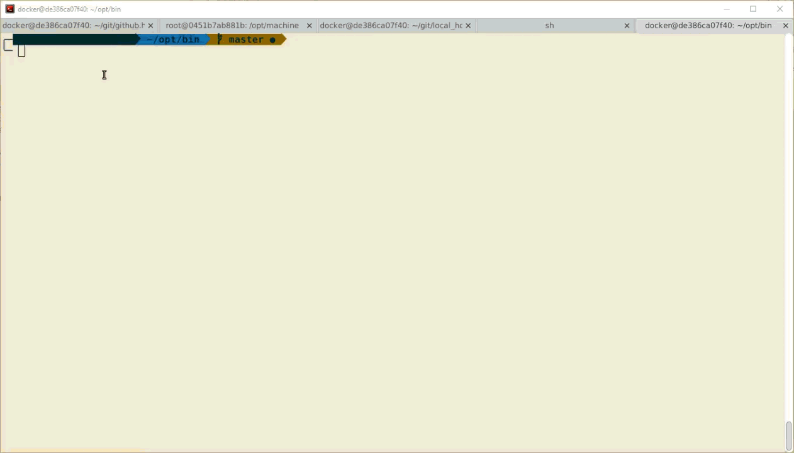

Docker Datacenter - env helper
============

I've been using [Docker Datcenter - Universal Control Plane](https://docs.docker.com/ucp/overview/) quiet a bit these days.
Logging in can sometimes be cumbersom to do from the command line, so I've
started a simple alias script called dindcenv to help me simplify this process.



Install
---------
The script is designed to run in bash shell prompts, with Linux systems.
Use the following command to get it setup:

```
curl -ks https://raw.githubusercontent.com/wenlock/myhome/master/opt/bin/setup_dindc_alias.sh | bash -
```

Usage
--------

Get started by loging into a new bash shell prompt and running the command `dindc-help`.
From there, read the help and get started using Docker Datacenter.


Contribute
==========
Tell me about your experience with this script and if it was useful for you.
If you find an issue, please submit a PR and tag me for help.
